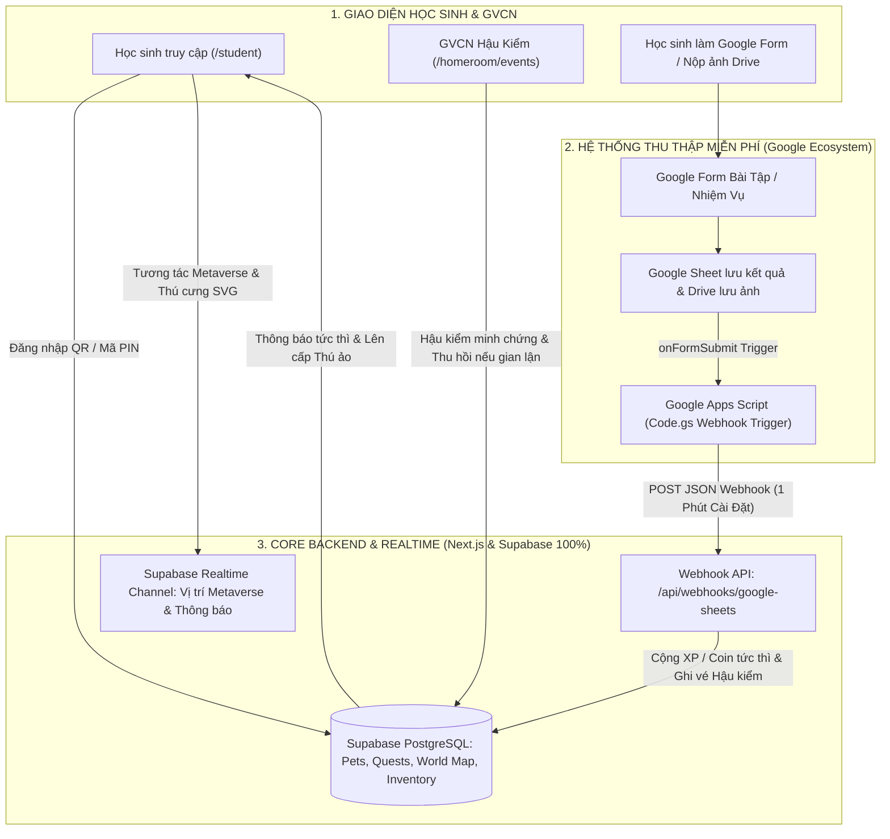
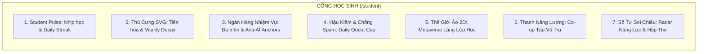

# TÀI LIỆU KIẾN TRÚC & CẤU TRÚC CỔNG HỌC SINH (STUDENT PORTAL SPECIFICATION)
> **Phiên bản:** v2.0 (Kiến Trúc Lai Hybrid, Ngân Hàng Nhiệm Vụ Động, Thú Cưng SVG & Metaverse 2D Lớp Học)  
> **Đường dẫn phân hệ:** `/student` (Student Space & Gamified Learning Portal)  
> **Đối tượng người dùng:** Học sinh các lớp (Hỗ trợ linh hoạt mọi môn học & công tác chủ nhiệm)  
> **Triết lý giáo dục & Thiết kế:** *"An toàn tâm lý (Psychological Safety) — Động lực nội tại (Intrinsic Motivation) — Động lực tức thì (Instant Gratification & Post-Audit) — Không gian kết nối 2D (Classroom Metaverse) — Tiện ích học đường 24/7."*

---

## I. KIẾN TRÚC TỔNG THỂ & GIẢI PHÁP LAI HYBRID (SUPABASE + GOOGLE APPS SCRIPT)



---

### 1. Tại Sao Chọn Kiến Trúc Lai (Hybrid Architecture)?

| Tiêu chí so sánh | Dùng 100% Google Sheets | Dùng 100% Supabase | **Kiến Trúc Lai Hybrid (Lựa chọn tối ưu)** |
| :--- | :--- | :--- | :--- |
| **Tốc độ & Realtime** | Rất chậm (vài giây độ trễ), không làm được Thế giới ảo di chuyển. | Cực nhanh (<50ms), hỗ trợ WebSocket Realtime. | ⚡ **Core Game chạy 100% Supabase Realtime mượt mà 60fps.** |
| **Chi phí lưu trữ ảnh bài làm** | Miễn phí không giới hạn trên Google Drive của giáo viên. | Tốn kém chi phí dung lượng Cloud Storage hàng tháng khi có hàng ngàn ảnh. | 💰 **Miễn phí 100% lưu trữ ảnh/bài tập qua Google Drive + Sheets.** |
| **Khả năng soạn bài tập của GV** | GV rất quen thuộc với Google Forms, dễ copy chia sẻ. | GV phải nhập liệu thủ công trên CMS riêng, khó tùy biến. | 📝 **GV tự tạo bài tập trên Google Forms trong 1 phút, tích hợp tức thì.** |

---

### 2. Mã Nguồn Webhook Dùng Chung Cho 60 Lớp Không Cần Sửa Code (`Universal Code.gs`)

> **Điểm ưu việt:** Dán **cùng 1 đoạn mã duy nhất** cho toàn bộ 60 Google Sheets của 60 lớp học. Script tự động nhận diện Mã Lớp (`Class ID`) từ Tiêu đề File Google Sheet (hoặc Tab cấu hình `_CONFIG`) mà không cần lập trình viên/giáo viên phải sửa tay từng file!

```javascript
/**
 * =========================================================================
 * UNIVERSAL GOOGLE APPS SCRIPT WEBHOOK — DÙNG CHUNG CHO 60 LỚP HỌC
 * Tác giả: Antigravity AI Dev Loop Engine
 * =========================================================================
 */
const GLOBAL_CONFIG = {
  ENDPOINT_URL: "https://your-app-domain.vercel.app/api/webhooks/google-sheets",
  GLOBAL_SECRET_TOKEN: "TBC_MASTER_WEBHOOK_SECRET_2026", // Khóa bảo mật chung toàn trường
  FALLBACK_CLASS_ID: "8A13"
};

function getAutoDetectedClassId() {
  const ss = SpreadsheetApp.getActiveSpreadsheet();
  
  // 1. Ưu tiên đọc từ Tab _CONFIG (nếu có)
  const configSheet = ss.getSheetByName("_CONFIG") || ss.getSheetByName("Cấu Hình");
  if (configSheet) {
    const val = String(configSheet.getRange("A2").getValue()).trim();
    if (val) return val;
  }
  
  // 2. Tự động trích xuất mã lớp từ Tên Sheet (VD: "Bài tập Toán 8A13", "Lớp 6A2 - 2026")
  const title = ss.getName();
  const match = title.match(/([6-9][A-Z][0-9]{1,2}|[6-9]\/[0-9]{1,2}|[6-9]A[0-9]{1,2})/i);
  if (match) return match[1].toUpperCase().replace("/", "A");
  
  return GLOBAL_CONFIG.FALLBACK_CLASS_ID;
}

function onFormSubmitTrigger(e) {
  try {
    const sheet = SpreadsheetApp.getActiveSpreadsheet().getActiveSheet();
    const lastRow = sheet.getLastRow();
    const lastCol = sheet.getLastColumn();
    const rowData = sheet.getRange(lastRow, 1, 1, lastCol).getValues()[0];
    const headers = sheet.getRange(1, 1, 1, lastCol).getValues()[0];

    const detectedClassId = getAutoDetectedClassId();

    const payload = {
      class_id: detectedClassId,
      secret_token: GLOBAL_CONFIG.GLOBAL_SECRET_TOKEN,
      timestamp: new Date().toISOString(),
      student_code: "",
      quest_code: "",
      score: 0,
      max_score: 10,
      proof_image_urls: [],
      raw_responses: {}
    };

    headers.forEach((header, index) => {
      const val = rowData[index];
      const hLower = String(header).toLowerCase();
      
      if (hLower.includes("mã học sinh") || hLower.includes("mã hs") || hLower.includes("student_code") || hLower.includes("stt")) {
        payload.student_code = String(val).trim().toLowerCase();
      } else if (hLower.includes("mã nhiệm vụ") || hLower.includes("nhiệm vụ") || hLower.includes("quest") || hLower.includes("bài tập")) {
        payload.quest_code = String(val).trim();
      } else if (hLower.includes("điểm") || hLower.includes("score")) {
        payload.score = Number(val) || 0;
      } else if (hLower.includes("ảnh") || hLower.includes("minh chứng") || hLower.includes("drive.google.com")) {
        if (val) payload.proof_image_urls.push(String(val));
      }
      payload.raw_responses[header] = val;
    });

    // Gửi Webhook sang Next.js App
    const options = {
      method: "post",
      contentType: "application/json",
      payload: JSON.stringify(payload),
      muteHttpExceptions: true
    };

    const response = UrlFetchApp.fetch(GLOBAL_CONFIG.ENDPOINT_URL, options);
    Logger.log(`[Webhook 60-Classes] Sent for Class ${detectedClassId}: ${response.getContentText()}`);
  } catch (err) {
    Logger.log("[Webhook Error]: " + err.toString());
  }
}
```

---

### 3. Công Cụ Tạo Hàng Loạt File Google Sheets Tự Động Từ Supabase DB (`AutoProvisionFromSupabase.gs`)

> **Điểm đột phá:** **Tuyệt đối không hardcode danh sách hay số lượng lớp học!** Script tự động kết nối qua API của ứng dụng (`GET /api/admin/classes-list`), đọc danh sách tất cả các lớp đang có trong cơ sở dữ liệu Supabase của trường học (dù là 15, 30 hay 60 lớp) và tự động tạo đúng số lượng file tương ứng trong 30 giây!

```javascript
/**
 * =========================================================================
 * SCRIPT NHÂN BẢN TỰ ĐỘNG THEO DANH SÁCH LỚP THỰC TẾ TRÊN SUPABASE
 * Tác giả: Antigravity AI Dev Loop Engine
 * =========================================================================
 */
const PROVISION_CONFIG = {
  APP_API_URL: "https://your-app-domain.vercel.app/api/admin/classes-list",
  ADMIN_API_KEY: "TBC_MASTER_ADMIN_KEY_2026",
  TEMPLATE_SHEET_ID: "YOUR_MASTER_TEMPLATE_SHEET_ID", // ID file mẫu đã có Universal Code.gs
  TARGET_FOLDER_ID: "YOUR_GOOGLE_DRIVE_FOLDER_ID"      // ID thư mục Google Drive chứa các lớp
};

function autoProvisionAllClassesFromSupabase() {
  // 1. Gọi API lấy danh sách lớp thực tế từ Supabase
  const options = {
    method: "get",
    headers: { "Authorization": `Bearer ${PROVISION_CONFIG.ADMIN_API_KEY}` },
    muteHttpExceptions: true
  };

  const response = UrlFetchApp.fetch(PROVISION_CONFIG.APP_API_URL, options);
  if (response.getResponseCode() !== 200) {
    Logger.log("Lỗi tải danh sách lớp từ Supabase: " + response.getContentText());
    return;
  }

  const classList = JSON.parse(response.getContentText()).data; // Mảng [{id: "uuid-1", name: "6A1"}, {name: "8A13"}...]
  Logger.log(`Đã tải về ${classList.length} lớp học từ cơ sở dữ liệu Supabase.`);

  const templateFile = DriveApp.getFileById(PROVISION_CONFIG.TEMPLATE_SHEET_ID);
  const targetFolder = DriveApp.getFolderById(PROVISION_CONFIG.TARGET_FOLDER_ID);
  const results = [];

  // 2. Tự động nhân bản file Sheet cho từng lớp
  classList.forEach(cls => {
    const className = cls.name || cls.id;
    const newFileName = `[Nộp Bài & Điểm Danh] Lớp ${className} - Năm Học 2025-2026`;
    const copiedFile = templateFile.makeCopy(newFileName, targetFolder);
    const newSheet = SpreadsheetApp.openById(copiedFile.getId());
    
    // Ghi mã lớp vào ô _CONFIG!A2
    let cfgSheet = newSheet.getSheetByName("_CONFIG");
    if (!cfgSheet) cfgSheet = newSheet.insertSheet("_CONFIG");
    cfgSheet.getRange("A1:C1").setValues([["CLASS_ID", "CLASS_NAME", "SUPABASE_UUID"]]);
    cfgSheet.getRange("A2:C2").setValues([[className, `Lớp ${className}`, cls.id || ""]]);
    cfgSheet.hideSheet();

    results.push({
      class_name: className,
      file_id: copiedFile.getId(),
      sheet_url: copiedFile.getUrl()
    });
    Logger.log(`✓ Đã tạo file Google Sheet cho lớp: ${className}`);
  });

  Logger.log(`🎉 HOÀN THÀNH TỰ ĐỘNG TẠO ${results.length} FILE LỚP HỌC!`);
}
```

---

## II. CHI TIẾT 7 PHÂN HỆ CỐT LÕI CỦA CỔNG HỌC SINH



---

### 1. Phân hệ 1: Student Pulse & Không Gian Cá Nhân (`/student`)
* **Mục tiêu:** Cung cấp thông tin quan trọng nhất trong 10 giây đầu tiên khi học sinh mở app.
* **Chức năng chi tiết:**
  * **Today Status Card:** Trạng thái chuyên cần hôm nay (Đã có mặt / Tiết học tiếp theo theo TKB).
  * **Lời Nhắn / Dặn Dò Của GVCN:** Hiển thị thông báo, lời nhắc nhở sinh hoạt của giáo viên chủ nhiệm.
  * **Daily Streak 🔥:** Chuỗi ngày chuyên cần & tự học liên tục; đạt mốc 7/14/30 ngày nhận Rương Thần Thoại.
  * **Daily Quest Cap Tracker:** Thanh giới hạn hoàn thành trong ngày (VD: *Đã hoàn thành 2/3 nhiệm vụ hôm nay — Hãy nghỉ ngơi hoặc quay lại ngày mai nhé!*).

---

### 2. Phân hệ 2: Hệ Thống Thú Cưng SVG — Ấp Trứng Từ Từ & Cơ Chế Suy Thoái Khi Lười (`/student/pet`)
* **Mục tiêu:** Kích hoạt động lực nội tại (Intrinsic Motivation) thông qua bản năng chăm sóc thực thể sống (Tamagotchi Loop), thúc đẩy tính kỷ luật và thói quen học tập bền bỉ.
* **Quy Trình Ấp Trứng Chậm Rãi & Tiến Hóa 5 Giai Đoạn:**
  * **Giai đoạn 0 — Quả Trứng Ma Thuật (Magic Egg):** Học sinh mới tạo tài khoản nhận 1 quả trứng ma thuật phát sáng nhẹ (`Tiến độ ấp: 0/5 nhiệm vụ`).
  * **Giai đoạn 1 — Trứng Nứt Vỏ (Cracking Egg):** Hoàn thành 3 nhiệm vụ đầu tiên, vỏ trứng xuất hiện các vết nứt tỏa ánh sáng neon theo nhánh đã chọn.
  * **Giai đoạn 2 — Linh Vật Sơ Sinh (Baby Hatchling):** Hoàn thành 5 nhiệm vụ đầu tiên, trứng vỡ và linh vật sơ sinh thò đầu ra, phát âm thanh vui tai (Web Audio API sound).
  * **Giai đoạn 3 — Thiếu Niên Có Cánh (Winged Teen - Level 10+):** Kích thước lớn hơn (90x90), mọc cánh, hiệu ứng hạt bụi ma thuật bay xung quanh.
  * **Giai đoạn 4 — Chiến Thú Giáp Sắt (Armored Titan - Level 20+):** Trang bị giáp ngực, đuôi lửa và hào quang tỏa sáng (120x120).
  * **Giai đoạn 5 — Thần Thú Tối Thượng (Cosmic Sovereign - Level 30+):** Hào quang toàn thân, hiệu ứng rực rỡ, vương miện tri thức tối thượng.
* **3 Nhánh Tiến Hóa Độc Đáo:**
  * 🌌 *Nhánh Ngân Hà (Cosmic)*: Tông màu Tím / Neon Xanh Cyan, hào quang vũ trụ.
  * 🌿 *Nhánh Tự Nhiên & Cổ Đại (Nature)*: Tông màu Ngọc Lục Bảo / Vàng Kim, dây leo thần thoại.
  * ⚡ *Nhánh Cơ Giáp Công Nghệ (Cyber)*: Tông màu Cam Lửa / Xanh Điện, mạch điện phát sáng.

* **Cơ Chế Suy Thoái, Trừ Lùi Cấp Độ & Ngủ Đông Khi Lười (Vitality Decay & Hibernation Engine):**
  * ⚠️ **Quy tắc 7 Ngày (1 Tuần không hoàn thành ít nhất 1 nhiệm vụ):**
    * Chỉ số sinh lực `vitality_percent` giảm từ 100% xuống **50%**.
    * Thú cưng chuyển sang trạng thái *"Đói & Ủ Rũ"*: Màu sắc nhạt đi, thu nhỏ kích thước 1 bậc, mất hiệu ứng hạt bụi, phát tiếng thở dài khi click.
  * 🛑 **Quy tắc 30 Ngày (1 Tháng hoàn toàn bỏ bê học tập):**
    * Thú cưng rơi vào trạng thái *"Ngủ Đông & Bị Thoái Hóa Cấp Độ"*:
      * Bị **trừ lùi 2 Cấp Độ** (Ví dụ: Từ Level 10 tụt về Level 8, mất cánh/mất giáp).
      * Linh vật hóa thành khối băng / tượng đá ngủ đông.
    * 💖 **Chuỗi Nhiệm Vụ Hồi Sinh (Revival Quests):** Để đánh thức thú cưng, học sinh phải hoàn thành liên tục 3 nhiệm vụ bất kỳ trong 3 ngày để truyền lại hơi ấm năng lượng.

---

### 3. Phân hệ 3: Ngân Hàng Nhiệm Vụ Mở Đa Môn Học & Cơ Chế Chống Văn Mẫu AI (`/student/quests`)
* **Mục tiêu:** Cung cấp khung nhiệm vụ mở cho **MỌI MÔN HỌC & HOẠT ĐỘNG GIÁO DỤC**; không hardcode đề bài, học sinh dễ làm, nộp sản phẩm kèm minh chứng đa phương tiện (Ảnh Drive / Video ngắn 30s / Mô tả) và **chống gian lận AI sao chép**.

#### 1. Khung Nhiệm Vụ Mở & Sản Phẩm Đa Phương Tiện:
* Không gò bó vào 1 môn học. Giáo viên mọi bộ môn đều có quyền tùy biến cài đặt:
  * 📐 *Toán học:* Hoàn thành 2 bài toán ngoài SGK / Sáng tạo 1 bài toán thực tế.
  * 🔬 *Khoa học tự nhiên:* Quay video 30s thí nghiệm đơn giản tại nhà / Chụp ảnh 1 hiện tượng vật lý đời sống.
  * 📜 *Ngữ văn & Lịch sử:* Thiết kế 1 sơ đồ tư duy Mindmap bằng AI/Canva tóm tắt nhân vật hoặc trận đánh.
  * 🌍 *Ngoại ngữ:* Ghi âm 45s phát âm đoạn văn / Chụp ảnh 5 từ vựng mới dán ở góc học tập.
  * 🤝 *Nề nếp & Đời sống:* Giúp đỡ cha mẹ nấu ăn, dọn dẹp nhà cửa, nhặt được của rơi.

#### 2. Cơ Chế Chống "Nhờ AI Viết Văn Hộ" — Neo Dữ Kiện Thực Tế (Grounded Verification Anchors):
Để triệt tiêu việc học sinh copy văn mẫu do ChatGPT sinh ra rồi dán vào, form nộp bài yêu cầu **4 Neo Dữ Kiện Bắt Buộc (4 Verification Anchors)**:
1. **Neo Hành Động Cụ Thể (Action Anchor):** Chọn hành động chính xác từ dropdown + ghi rõ số lượng (VD: *Rửa 6 cái bát và lau bàn ăn* thay vì viết chung chung "làm việc nhà").
2. **Neo Thời Gian & Địa Điểm Thực (Temporal Anchor):** Ghi rõ khung giờ thực hiện (VD: *Lúc 19h15 tối thứ Năm tại phòng bếp*).
3. **Neo Vật Chứng Nhận Diện (Physical Pet Anchor):** Ảnh/Video nộp bắt buộc có **Tờ giấy ghi Bí Danh Thú Cưng** (VD: `Rồng Lửa #821`) hoặc ngày giờ đặt cạnh sản phẩm ➔ AI không thể giả mạo ảnh thực tế của học sinh.
4. **Phản Chiếu Cảm Xúc Ngắn (1-2 Câu Thật):** 1-2 câu cảm nhận tự nhiên của bản thân (VD: *"Mẹ bất ngờ và khen em rửa sạch, em thấy vui"*), không chấp nhận văn mẫu sáo rỗng.

#### 3. Nhịp Độ Tăng Dần Theo Tuần (Progressive Difficulty Curve):
* **Tuần 1 - 4 (Khởi Động Thói Quen):** Nhiệm vụ siêu ngắn (3-5 phút: Check-in, dọn bàn học, 3 câu trắc nghiệm).
* **Tuần 5 - 15 (Phát Triển Kỹ Năng):** Nhiệm vụ tư duy & sáng tạo (Mindmap, bài tập ngoài SGK, video 30s).
* **Tuần 16 - 35 (Chinh Phục & Liên Môn):** Dự án nhỏ, thử thách tuần phối hợp nhóm.
* **Tính Linh Hoạt Thời Gian:** Học sinh không bắt buộc phải làm rải rác mỗi ngày; có thể làm tích lũy trong tuần và **nộp dồn vào cuối tuần** khi có thời gian rảnh.

---

### 4. Phân hệ 4: Luồng Hoàn Thành Tức Thì, Hậu Kiểm & Giới Hạn Ngày (Daily Quest Cap)
* **Chống Cày Điểm Spam Bằng Daily Quest Cap:**
  * Giới hạn tối đa **3 - 4 nhiệm vụ/ngày** (GVCN có thể tùy chỉnh trong Settings).
  * Giúp học sinh duy trì nhịp học điều độ, không bị quá tải hay "cày cuốc thâu đêm".
* **Luồng Auto-Complete Nhận Thưởng 100ms & Hậu Kiểm Sư Phạm:**
  * Học sinh submit Form ➔ Nhận ngay XP/Coin và năng lượng Tàu Vũ Trụ trong 100ms.
  * Ticket được lưu vào hàng đợi **Hậu kiểm (Post-Audit)** trên `/homeroom/events`.
  * GVCN lướt xem ảnh minh chứng có Neo vật chứng (Bí danh Pet) ➔ Nếu hợp lệ thì bỏ qua; nếu gian lận ➔ Bấm **[Thu Hồi Điểm (Revoke)]** 1-Click.

---

### 5. Phân hệ 5: Thế Giới Ảo 2D Lớp Học (Classroom Metaverse & Village Grid) (`/student/map`)
* **Mục tiêu:** Tạo không gian chung kết nối toàn bộ thành viên trong lớp một cách trực quan, vui nhộn nhưng bảo toàn 100% tính ẩn danh an toàn.
* **Cơ chế Hoạt Động Của Metaverse 2D (Grid-Based Classroom Village):**
  * **Bản Đồ Làng Lớp Học:** Bản đồ lưới $8 \times 8$ hoặc $10 \times 10$ ô đất tọa độ `(x, y)`.
  * **Mảnh Đất Riêng Của Mỗi Học Sinh:** Mỗi Bí danh (VD: `Phượng Hoàng #821`) được cấp 1 ô đất để xây dựng cơ ngơi.
  * **Cửa Hàng Vật Phẩm (Class Shop):** Học sinh dùng Coin kiếm được từ bài tập để mua sắm:
    * 🏠 *Kiến trúc:* Nhà gỗ nhỏ, Trạm không gian, Tháp tri thức, Lều thám hiểm.
    * 🌳 *Cảnh quan:* Cây tri thức, Bồn hoa ma thuật, Đèn đường neon, Hồ nước phát sáng.
    * 🏆 *Vinh danh:* Bục cúp Toán học, Cờ thi đua Tổ, Bảng vinh danh chuỗi Streak.
  * **Tham Quan Nhà Bạn Ẩn Danh:** Bấm vào ô đất của bạn bè để tham quan cơ ngơi, xem linh vật SVG của bạn đang cư ngụ và bảng thành tích ẩn danh (VD: *Nhà của Rồng Lửa #104 — Level 28 — 4 Cúp Vàng — Streak 21 ngày*).

---

### 6. Phân hệ 6: Thanh Năng Lượng Đồng Đội (Co-op Class Spirit) (`/student/coop`)
* **Mục tiêu:** Xóa bỏ sự cô lập, kéo tất cả học sinh cùng tham gia vào mục tiêu chung của tổ và của cả tập thể lớp.
* **Chức năng chi tiết:**
  * **Thanh Năng Lượng Tàu Vũ Trụ Của Lớp:** Toàn bộ điểm bài tập và nề nếp của từng cá nhân tự động đổ vào "Thùng nhiên liệu" chung. Đạt 100% mở khóa phần thưởng thực tế (buổi chiếu phim khoa học, 1 ngày không bài tập về nhà).
  * **Biệt Đội 4 Tổ Hợp Lực:** Hiển thị 4 Linh vật đại diện cho 4 Tổ; khi 100% tổ viên hoàn thành nhiệm vụ tuần, toàn tổ nhận Buff x1.2 XP.

---

### 7. Phân hệ 7: Nhật Ký Tự Rèn Luyện & Hộp Thư Tâm Sự GVCN (`/student/records`)
* **Mục tiêu:** Giúp học sinh tự soi chiếu sự tiến bộ của bản thân và có kênh liên lạc riêng tư, an toàn với Giáo viên Chủ nhiệm.
* **Chức năng chi tiết:**
  * **Biểu Đồ Radar Năng Lực 4 Trục:** Chuyên cần, Học tập, Nề nếp, Hoạt động phong trào.
  * **Hộp Thư Tâm Sự Riêng Tư (Private Counselor Box):** Học sinh nhắn gửi khó khăn học tập hoặc tâm tư với GVCN mà không sợ bạn bè trêu chọc.

---

## III. THIẾT KẾ CƠ SỞ DỮ LIỆU SUPABASE MỞ RỘNG (ENHANCED SCHEMA)

```sql
-- 1. BẢNG NGÂN HÀNG NHIỆM VỤ ĐỘNG (DYNAMIC QUEST BANK)
CREATE TABLE student_quest_bank (
    id UUID PRIMARY KEY DEFAULT gen_random_uuid(),
    school_id VARCHAR(50) DEFAULT 'THCS-TBC',
    class_id UUID REFERENCES classes(id) ON DELETE CASCADE, -- NULL nếu là nhiệm vụ dùng chung toàn trường
    subject_code VARCHAR(50) DEFAULT 'MATH', -- 'MATH' | 'HOMEROOM' | 'PHYSICS' | 'LITERATURE' | 'ALL'
    category VARCHAR(50) NOT NULL, -- 'academic' | 'habit_life' | 'social_peer' | 'event_special'
    title VARCHAR(255) NOT NULL,
    description TEXT,
    week_timeline_start INT DEFAULT 1, -- Tuần bắt đầu mở (1 - 35)
    week_timeline_end INT DEFAULT 35,
    reward_xp INT DEFAULT 50,
    reward_coins INT DEFAULT 10,
    google_form_url TEXT, -- Link form bài tập nếu có
    requires_proof_image BOOLEAN DEFAULT FALSE,
    is_active BOOLEAN DEFAULT TRUE,
    created_at TIMESTAMPTZ DEFAULT NOW()
);

-- 2. BẢNG TIẾN ĐỘ NHIỆM VỤ & HÀNG ĐỢI HẬU KIỂM (QUEST COMPLETIONS & POST-AUDIT)
CREATE TABLE student_quest_completions (
    id UUID PRIMARY KEY DEFAULT gen_random_uuid(),
    quest_id UUID NOT NULL REFERENCES student_quest_bank(id) ON DELETE CASCADE,
    student_id UUID NOT NULL REFERENCES students(id) ON DELETE CASCADE,
    class_id UUID NOT NULL REFERENCES classes(id) ON DELETE CASCADE,
    proof_urls TEXT[], -- Mảng link ảnh trên Google Drive / Supabase
    score_achieved NUMERIC(5, 2) DEFAULT 10.0,
    xp_awarded INT NOT NULL,
    coins_awarded INT NOT NULL,
    status VARCHAR(30) DEFAULT 'auto_completed', -- 'auto_completed' | 'verified' | 'revoked'
    audit_note TEXT,
    audited_by UUID REFERENCES profiles(id),
    audited_at TIMESTAMPTZ,
    created_at TIMESTAMPTZ DEFAULT NOW()
);

-- 3. BẢNG THÚ CƯNG SVG & THÔNG TIN TIẾN HÓA (SVG PETS)
CREATE TABLE student_pets (
    id UUID PRIMARY KEY DEFAULT gen_random_uuid(),
    student_id UUID NOT NULL REFERENCES students(id) ON DELETE CASCADE,
    class_id UUID NOT NULL REFERENCES classes(id) ON DELETE CASCADE,
    anonymous_name VARCHAR(100) NOT NULL, -- VD: 'Phượng Hoàng Băng #821'
    evolution_branch VARCHAR(50) DEFAULT 'cosmic', -- 'cosmic' | 'nature' | 'cyber'
    level INT DEFAULT 1,
    current_xp INT DEFAULT 0,
    vitality_percent INT DEFAULT 100,
    streak_days INT DEFAULT 0,
    last_checkin_date DATE,
    total_coins INT DEFAULT 0,
    custom_svg_data TEXT, -- Chuỗi SVG tùy biến hoặc cấu hình hạt
    created_at TIMESTAMPTZ DEFAULT NOW(),
    updated_at TIMESTAMPTZ DEFAULT NOW(),
    UNIQUE(student_id, class_id)
);

-- 4. BẢNG TỌA ĐỘ THẾ GIỚI ẢO METAVERSE (CLASSROOM WORLD GRIDS)
CREATE TABLE student_world_plots (
    id UUID PRIMARY KEY DEFAULT gen_random_uuid(),
    class_id UUID NOT NULL REFERENCES classes(id) ON DELETE CASCADE,
    pet_id UUID NOT NULL REFERENCES student_pets(id) ON DELETE CASCADE,
    grid_x INT NOT NULL, -- Tọa độ ô đất (0 - 9)
    grid_y INT NOT NULL, -- Tọa độ ô đất (0 - 9)
    plot_theme VARCHAR(50) DEFAULT 'meadow', -- 'meadow' | 'space_station' | 'ancient_ruin'
    building_item_code VARCHAR(100) DEFAULT 'cozy_cabin',
    decorations JSONB DEFAULT '[]'::jsonb, -- Danh sách vật phẩm đặt trong ô đất [{item: "trophy_math", x: 1, y: 2}]
    updated_at TIMESTAMPTZ DEFAULT NOW(),
    UNIQUE(class_id, grid_x, grid_y),
    UNIQUE(class_id, pet_id)
);

-- 5. BẢNG CỬA HÀNG VẬT PHẨM METAVERSE (VIRTUAL SHOP ITEMS)
CREATE TABLE virtual_shop_items (
    id UUID PRIMARY KEY DEFAULT gen_random_uuid(),
    item_code VARCHAR(100) UNIQUE NOT NULL,
    item_name VARCHAR(150) NOT NULL,
    category VARCHAR(50) NOT NULL, -- 'building' | 'decoration' | 'pet_aura' | 'theme'
    price_coins INT NOT NULL,
    svg_asset_data TEXT NOT NULL,
    required_level INT DEFAULT 1,
    is_available BOOLEAN DEFAULT TRUE
);
```

---

## IV. BẢNG SO SÁNH GIÁ TRỊ TOÀN DIỆN: CŨ VS MỚI

| Tiêu chí | Mô hình truyền thống | Cổng Học Sinh Thế Hệ Mới (/student v2.0) |
| :--- | :--- | :--- |
| **Soạn bài & Đề thi** | Phải nhập từng câu vào CMS phức tạp. | **Dùng Google Forms sẵn có + 1 Phút Webhook**, tự động cộng điểm. |
| **Lưu trữ ảnh minh chứng** | Tốn dung lượng đắt đỏ, dễ quá tải. | **Lưu 100% miễn phí trên Google Drive của GV / Lớp**. |
| **Phản hồi kết quả** | Chờ giáo viên chấm thủ công mới biết điểm. | **Auto-Complete nhận XP/Coin trong 100ms** (GV hậu kiểm sau). |
| **Đồ họa Thú ảo** | Ảnh PNG mờ hạt, dung lượng nặng. | **Chuỗi Vector SVG siêu nhẹ, biến đổi hình thái 5 cấp độ sắc nét**. |
| **Kết nối lớp học** | Thi đua điểm số khô khan, ganh ghét ngầm. | **Metaverse 2D Làng Lớp Học**: Xây nhà, mua đồ decor, thăm nhà bạn bè ẩn danh. |
