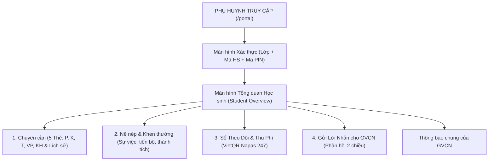

# TÀI LIỆU KIẾN TRÚC & CẤU TRÚC CỔNG PHỤ HUYNH (PARENT PORTAL SPECIFICATION)

> **Đường dẫn phân hệ:** `/portal` (Parent Student Portal)  
> **Đối tượng người dùng:** Phụ huynh học sinh & Học sinh  
> **Mục tiêu:** Cung cấp kênh tra cứu minh bạch, tức thì và tiện lợi 24/7 về tình hình chuyên cần, nề nếp, kết quả học tập, học phí/các khoản thu VietQR và là cầu nối tương tác 2 chiều giữa Phụ huynh và Giáo viên Chủ nhiệm.

---

## I. HIỆN TRẠNG KIẾN TRÚC KỸ THUẬT & DỮ LIỆU CỔNG PHỤ HUYNH

### 1. Cơ chế Xác thực & Phiên làm việc (Session & Security)
* **Xác thực 3 lớp (3-Factor Look-up):**
  1. `classId`: ID lớp học của học sinh.
  2. `studentIdInput`: Mã học sinh, Mã định danh Bộ GD&ĐT hoặc CCCD.
  3. `pinCodeInput`: Mã PIN bảo mật 6 số của lớp (mặc định do GVCN cấu hình trong `homeroom_class_settings.pin_code`).
* **Lưu trữ phiên (Session Persistence):**
  * Tùy chọn *"Ghi nhớ tra cứu trên thiết bị này"* lưu vào `localStorage` key `tbc_portal_parent_session`.
  * Tự động xác thực lại khi phụ huynh mở lại trình duyệt mà không cần nhập lại.

---

### 2. Các Phân hệ Chức năng trên Giao diện Cổng Phụ Huynh

---

### 3. Chi tiết 4 Tab Chức năng Hiện Tại:

1. **Header & Thông tin Tổng quan:**
   * Hiển thị Họ tên học sinh, Lớp, Mã HS, Tên GVCN, Tỷ lệ chuyên cần tổng thể (`%`).
   * Hiển thị Thông báo chung (`announcement`) của GVCN gửi cho toàn thể phụ huynh lớp.
2. **Tab 1: Chuyên cần & Nề nếp (`attendance`):**
   * 5 Thẻ thống kê chuẩn ngành giáo dục:
     * **PHÉP (P):** Vắng có phép.
     * **KHÔNG (K):** Vắng không phép.
     * **TRỄ (T):** Đi muộn.
     * **VI PHẠM (VP):** Vi phạm nội quy / kỷ luật.
     * **KHEN THƯỞNG (KH):** Tuyên dương, việc tốt.
   * Danh sách dòng thời gian chi tiết từng buổi/tiết điểm danh.
3. **Tab 2: Nề nếp & Khen thưởng (`events`):**
   * Danh sách sự việc được GVCN bật quyền xem công khai (`is_visible_to_parent: true`).
   * Ghi nhận thành tích, khen thưởng, biểu dương và kết quả xử lý rèn luyện.
4. **Tab 3: Sổ Theo Dõi & Thu Phí VietQR (`monitor`):**
   * Hiển thị các cột theo dõi do GVCN mở chia sẻ (`isSharedWithParents: true`).
   * Tích hợp thanh toán học phí / quỹ lớp qua chuẩn **VietQR Napas 247**:
     * Tự động sinh mã QR động kèm số tiền chính xác và cú pháp chuyển khoản chứa Mã HS.
     * Hỗ trợ thanh toán nhanh bằng ứng dụng ngân hàng di động.
5. **Tab 4: Gửi Lời Nhắn cho GVCN (`message`):**
   * Phụ huynh nhập nội dung lời nhắn, thắc mắc hoặc thông tin cần trao đổi với GVCN.
   * Dữ liệu được lưu vào bảng `homeroom_parent_contacts` với loại `portal_feedback`.

---

## II. KẾ HOẠCH CẢI TIẾN TOÀN DIỆN CHO CỔNG PHỤ HUYNH (/portal)

### 1. Tuyên ngôn thiết kế (North Star):
> **"Mỗi phụ huynh mở Portal trong 10 giây phải biết ngay: Con mình hôm nay thế nào, có việc gì cần mình làm (Action Item), và nhà trường đang cần mình phối hợp ở đâu."**

```mermaid
graph LR
    subgraph Portal ["CỔNG PHỤ HUYNH (/portal)"]
        P1["1. Today Pulse (Hôm nay con thế nào?)"]
        P2["2. Online Leave Request (Đơn xin nghỉ phép)"]
        P3["3. Smart VietQR & E-Receipts (Biên lai điện tử)"]
        P4["4. Collaboration Cases (Phối hợp 2 chiều)"]
        P5["5. Growth Timeline (Tiến trình rèn luyện 360)"]
    end

    subgraph Homeroom ["MODULE GVCN (/homeroom)"]
        H1["Duyệt phép 1-Click -> Điểm danh (P)"]
        H2["Xác nhận chuyển khoản -> Thu tiền"]
        H3["Ghi nhận tiến bộ / Sự việc nề nếp"]
        H4["Phản hồi ý kiến phụ huynh"]
    end

    Portal <===>|"Liên thông dữ liệu thời gian thực"| Homeroom
```

---

### 2. 3 "Killer Features" Độc Đáo Dành Cho Phụ Huynh:
1. **Killer #1 — Today Pulse ("Hôm nay con thế nào?"):**
   * Tóm tắt 10 giây: Trạng thái hiện diện (Có mặt/Đi muộn/Vắng), sức khỏe, nề nếp trong ngày, thông báo từ GVCN.
2. **Killer #2 — Closed-Loop Leave Request (Đơn xin nghỉ phép trực tuyến khép kín):**
   * Phụ huynh nộp đơn trực tiếp trên Portal (chọn ngày, lý do, ảnh giấy khám).
   * GVCN nhận thông báo, bấm **Duyệt 1-Click** ➔ Tự động đánh dấu Phép (`P`) trên bảng điểm danh ngày đó mà không cần chép tay.
3. **Killer #3 — Smart VietQR & Lịch sử Biên lai Điện tử (E-Receipts):**
   * Sinh mã VietQR động chính xác từng khoản thu, nút bấm *"Tôi đã chuyển khoản"* kèm ảnh chụp màn hình banking.
   * Thủ quỹ/GVCN xác nhận ➔ Tự động sinh Biên lai điện tử lưu trữ minh bạch trên Portal.

---

### 3. Bảng So Sánh Trước vs Sau (Before vs After) Cho Cổng Phụ Huynh:

| Phân hệ Cổng Phụ Huynh | Hiện trạng Trước cải tiến | Sau cải tiến (Kế hoạch C) | Bước nhảy trải nghiệm |
| :--- | :--- | :--- | :--- |
| **Xác thực & Tra cứu** | Phải nhớ Mã lớp, gõ Mã định danh dài và Mã PIN 6 số. | **Quét mã QR Thẻ học sinh 1-Click** hoặc Tra cứu bằng Số điện thoại phụ huynh. | Đăng nhập tức thì **≤ 3 giây**, không cần nhớ mã lớp. |
| **Tình trạng hàng ngày** | Phải tự vào xem từng thẻ số liệu chuyên cần. | **Today Pulse Card:** Tóm tắt 10 giây tình hình con hôm nay (Đã đến lớp, chuyên cần, việc cần làm). | Nắm bắt trạng thái con **ngay trong 10 giây đầu tiên**. |
| **Xin nghỉ phép** | Gọi điện, nhắn Zalo riêng lẻ; GVCN dễ quên ghi sổ điểm danh. | **Đơn xin nghỉ phép trực tuyến:** PH gửi đơn ➔ GVCN duyệt 1-click ➔ Tự động cập nhật bảng điểm danh. | Quy trình chuẩn mực, minh bạch, **tiết kiệm 100% thời gian** gọi điện. |
| **Thu phí & Học phí** | Xem số tiền, quét VietQR nhưng không biết trường đã nhận chưa. | **Smart VietQR + Biên lai điện tử:** Báo đã chuyển khoản + Biên lai xác nhận từ nhà trường. | Minh bạch tài chính 100%, **không lo thất lạc tiền đóng góp**. |
| **Tương tác với GVCN** | Nhắn tin 1 chiều, không biết giáo viên đã xem hay phản hồi chưa. | **Collaboration Cases 2 chiều:** Trạng thái Đã xem / Đã phản hồi + Tham gia **Khảo sát/Biểu quyết trực tuyến** (Poll). | Xây dựng sự gắn kết và tin tưởng thực chất giữa Gia đình và Nhà trường. |
| **Sổ liên lạc & Báo cáo** | Chỉ xem dữ liệu thô trên web. | **E-Report Card:** Xem và tải Phiếu báo cáo rèn luyện tháng / học kỳ dạng PDF/Ảnh gửi về máy. | Phụ huynh dễ dàng lưu trữ và đồng hành cùng con. |
