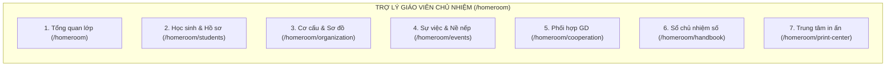

# TÀI LIỆU CẤU TRÚC PHÂN HỆ GIÁO VIÊN CHỦ NHIỆM (HOMEROOM ASSISTANT MODULE SPECIFICATION)

> **Định vị phân hệ:** Không gian làm việc số hoá toàn diện dành riêng cho **Giáo viên Chủ nhiệm (GVCN)** nhằm giải phóng giáo viên khỏi gánh nặng sổ sách thủ công, quản lý lớp học khoa học, đồng hành cùng học sinh và phối hợp chặt chẽ với phụ huynh & giáo viên bộ môn.  
> **Đường dẫn gốc:** `/homeroom` (Layout chuyên biệt: `src/app/homeroom/layout.tsx`)

---

## I. KIẾN TRÚC & DỮ LIỆU CỦA MODULE GVCN

### 1. Cơ sở dữ liệu Supabase phục vụ GVCN
Module GVCN hoạt động dựa trên các bảng chuyên biệt sau trên Supabase:
1. `homeroom_class_settings`: Lưu mã PIN tra cứu của lớp (`pin_code`), cấu hình sơ đồ chỗ ngồi (`seating_chart`, `classroom_layout`), cơ cấu ban cán sự & 4 tổ (`class_structure`), thông báo chung gửi phụ huynh (`announcement`).
2. `homeroom_events`: Nhật ký ghi nhận sự việc nề nếp, khen thưởng, vi phạm, chuyên cần, học tập (`type`, `category`, `severity`, `points_delta`, `description`, `source`, `action_taken`, `result`, `status`, `is_visible_to_parent`).
3. `homeroom_interventions`: Kế hoạch can thiệp & hỗ trợ học sinh cá biệt/tiến bộ chậm (`issue_summary`, `goals`, `measures`, `coordinated_with`, `parent_cooperation`, `status`).
4. `homeroom_plans`: Kế hoạch chủ nhiệm tuần, tháng, cả năm học (`plan_type`, `period_key`, `title`, `content` gồm mục tiêu, nhiệm vụ tuần checklist, chỉ tiêu thi đua, đặc điểm tình hình).
5. `homeroom_parent_contacts`: Nhật ký trao đổi phối hợp với phụ huynh và ý kiến phản hồi của giáo viên bộ môn (`contact_type`: cuộc gọi, gặp trực tiếp, tin nhắn, phản hồi portal, ý kiến GVBM; `agreed_solution`, `status`).
6. `attendance_records_v3`: Nguồn dữ liệu chuyên cần thực tế liên kết với phân hệ điểm danh nhanh.
7. `students`, `student_classes`, `teacher_classes`: Danh sách học sinh và phân công chủ nhiệm.

---

## II. CHI TIẾT 7 PHÂN HỆ CỐT LÕI CỦA MODULE GVCN

---

### 1. Phân hệ 1: Tổng quan lớp (`/homeroom`)
* **Mục tiêu:** Cung cấp bức tranh toàn cảnh (Bird's-eye View) về tình hình lớp học trong ngày và trong tuần.
* **Chức năng hiện tại:**
  * Thẻ thống kê chuyên cần thời gian thực: Sĩ số, Có mặt hôm nay, Đi muộn, Vắng (có phép / không phép).
  * Danh sách sự việc nề nếp cần theo dõi khẩn cấp (Sự việc trạng thái `open` / `monitoring`).
  * Bảng vinh danh việc tốt & tiến bộ gần nhất của học sinh trong lớp.
  * Danh sách việc cần làm trong tuần (Weekly Checklist) có chức năng tích chọn hoàn thành và lưu vào cơ sở dữ liệu.
  * Bộ chọn nhanh mẫu nhiệm vụ tuần (Preset Picker) để thêm nhanh các đầu việc phổ biến (Sinh hoạt đầu tuần, họp ban cán sự, kiểm tra vệ sinh...).

---

### 2. Phân hệ 2: Danh Sách & Hồ Sơ Giáo Dục Học Sinh (`/homeroom/students`)
* **Mục tiêu:** Quản lý trích ngang thông tin từng học sinh và theo dõi tiến trình phát triển cá nhân của từng em suốt năm học.
* **Chức năng hiện tại:**
  * Bảng danh sách học sinh: STT, Mã định danh, Họ và tên, Giới tính, Ngày sinh, Tình trạng đi học.
  * Bộ lọc tìm kiếm nhanh theo tên hoặc mã học sinh.
  * Drawer Hồ sơ giáo dục cá nhân (Student Educational Profile):
    * Thống kê tỷ lệ chuyên cần cá nhân (Tổng ngày, Có mặt, Vắng P/K, Đi muộn).
    * Dòng thời gian sự việc & nề nếp (Timeline khen thưởng / vi phạm của riêng học sinh đó).
    * Lịch sử các đợt can thiệp, hỗ trợ cá nhân và nhật ký liên hệ phụ huynh.
  * Xuất Phiếu liên lạc / Báo cáo cá nhân dạng file Word (.docx) chuẩn chỉnh gửi phụ huynh.

---

### 3. Phân hệ 3: Cơ Cấu Lớp & Sơ Đồ Chỗ Ngồi (`/homeroom/organization`)
* **Mục tiêu:** Tổ chức bộ máy tự quản của lớp (Ban cán sự, 4 Tổ) và bố trí sơ đồ lớp học trực quan.
* **Chức năng hiện tại:**
  * **Tab 1 - Ban Cán Sự Lớp:** Bổ nhiệm Lớp trưởng, Lớp phó học tập, Lớp phó kỷ luật, Lớp phó phong trào, Thủ quỹ từ danh sách học sinh của lớp.
  * **Tab 2 - Phân Chia 4 Tổ:** Thiết lập Tổ trưởng, Tổ phó và phân bổ danh sách thành viên cho 4 tổ học tập.
  * **Tab 3 - Sơ Đồ Lớp Học Tương Tác (Seat Layout Editor):**
    * Trình biên tập sơ đồ lớp học kéo-thả trực quan theo hàng/dãy bàn.
    * Đổi chỗ ngồi, gắn học sinh vào từng vị trí bàn, phân biệt màu sắc nam/nữ.
    * Xuất danh sách phân công và sơ đồ ra file Word / Ảnh phục vụ dán góc lớp học.

---

### 4. Phân hệ 4: Nhật Ký Sự Việc & Nề Nếp Học Sinh (`/homeroom/events`)
* **Mục tiêu:** Ghi nhận minh bạch mọi diễn biến nề nếp, khen thưởng và vi phạm xảy ra trong lớp học.
* **Chức năng hiện tại:**
  * Ghi nhận sự việc đa dạng: Khen thưởng (`positive`), Vi phạm (`violation`), Chuyên cần (`attendance`), Học tập (`academic`), Kỷ luật (`behavior`), Hoạt động (`activity`).
  * Tích hợp Bộ mẫu Preset 1-click (hơn 30+ mẫu vi phạm và khen thưởng phổ biến chuẩn trường học).
  * Chấm điểm cộng/trừ rèn luyện linh hoạt (`points_delta` từ -10 đến +10).
  * Ghi nhận biện pháp xử lý (`action_taken`) và kết quả theo dõi (`result`).
  * Thiết lập quyền xem cho phụ huynh trên Cổng Portal (`is_visible_to_parent`).
  * Quản lý Kế hoạch can thiệp & Hỗ trợ học sinh (Interventions): Lập mục tiêu, biện pháp rèn luyện, phối hợp gia đình và theo dõi hạn đánh giá.
  * Xuất Biên bản ghi nhận sự việc & Bản cam kết rèn luyện (.docx) có chữ ký học sinh và phụ huynh.

---

### 5. Phân hệ 5: Phối Hợp Giáo Dục & Liên Lạc Phụ Huynh (`/homeroom/cooperation`)
* **Mục tiêu:** Cầu nối trao đổi 2 chiều giữa GVCN với Phụ huynh học sinh và Giáo viên Bộ môn (GVBM).
* **Chức năng hiện tại:**
  * **Tab 1 - Nhật Ký Liên Lạc Phụ Huynh:** Lưu lại nội dung các cuộc gọi điện thoại, gặp gỡ trực tiếp, trao đổi Zalo, thống nhất giải pháp giáo dục giữa nhà trường và gia đình.
  * **Tab 2 - Phản Hồi Từ Cổng Phụ Huynh (Portal Feedback):** Tiếp nhận ý kiến, thắc mắc, phản ánh gửi từ Cổng Portal của phụ huynh học sinh.
  * **Tab 3 - Ý Kiến Giáo Viên Bộ Môn:** Tiếp nhận nhận xét, đánh giá của các giáo viên bộ môn về ý thức học tập, chuẩn bị bài, đồ dùng học tập của lớp trong từng tiết dạy.

---

### 6. Phân hệ 6: Sổ Chủ Nhiệm Điện Tử Số Hóa (`/homeroom/handbook`)
* **Mục tiêu:** Số hóa toàn bộ cuốn Sổ Chủ Nhiệm truyền thống theo chuẩn quy định của ngành giáo dục (Thông tư 22/27/58/Bộ GD&ĐT).
* **Chức năng hiện tại:**
  * Soạn thảo và lưu trữ Kế hoạch chủ nhiệm cả năm:
    * Đặc điểm tình hình: Thuận lợi, khó khăn của lớp.
    * Chỉ tiêu phấn đấu: Tỷ lệ học lực Giỏi/Khá, Hạnh kiểm Tốt, danh hiệu thi đua lớp.
    * Các biện pháp thực hiện chính trong năm học.
  * Tích hợp Bộ mẫu kế hoạch sẵn (Handbook Templates) theo từng cấp học để GVCN tham khảo và áp dụng nhanh.
  * Tự động đồng bộ số liệu sĩ số, ban cán sự, danh sách tổ vào nội dung sổ.
  * Nút lưu dữ liệu tự động lên Supabase Cloud.

---

### 7. Phân hệ 7: Trung Tâm In Ấn & Xuất Bản Sổ Sách Chuẩn Word (`/homeroom/print-center`)
* **Mục tiêu:** Cung cấp bộ mẫu văn bản hành chính sư phạm chuẩn mực 100% định dạng Word (.docx) để in ấn hoặc nộp cho Ban Giám Hiệu kiểm tra định kỳ.
* **5 Mẫu biểu hành chính xuất bản 1-click hiện có:**
  1. **BM-01/GVCN:** Danh Sách Học Sinh & Cơ Cấu Ban Cán Sự Lớp (kèm SĐT phụ huynh).
  2. **BM-02/GVCN:** Sổ Kế Hoạch & Quản Lý Chủ Nhiệm Trọn Gói (Đặc điểm tình hình, chỉ tiêu, biện pháp, danh sách).
  3. **BM-03/GVCN:** Phiếu Thông Báo Tình Hình Rèn Luyện & Học Tập (Gửi phụ huynh).
  4. **BM-04/GVCN:** Biên Bản Ghi Nhận Sự Việc Nề Nếp & Bản Cam Kết Rèn Luyện.
  5. **BM-05/GVCN:** Biên Bản Cuộc Họp Cha Mẹ Học Sinh Đầu Năm / Học Kỳ.
