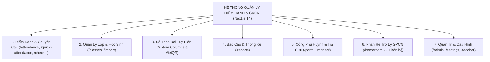

# TÀI LIỆU KIẾN TRÚC & CẤU TRÚC HỆ THỐNG TOÀN DIỆN (SYSTEM ARCHITECTURE & MODULES SPECIFICATION)

> **Tên hệ thống:** Hệ Thống Quản Lý Điểm Danh, Nề Nếp & Trợ Lý Giáo Viên Chủ Nhiệm (School Management & Homeroom Assistant Platform)  
> **Phiên bản hiện tại:** `02.2026` (RBAC v3.0, Next.js 14 App Router, Supabase Cloud PostgreSQL)  
> **Mục tiêu:** Cung cấp giải pháp chuyển đổi số toàn diện cho nhà trường, giáo viên bộ môn, ban giám thị, ban cán sự, phụ huynh và đặc biệt là phân hệ **Giáo viên Chủ nhiệm (GVCN)** hỗ trợ quản lý học sinh 360 độ từ nề nếp, học tập, hồ sơ cá nhân đến xuất sổ sách quy chuẩn Bộ GD&ĐT.

---

## I. KIẾN TRÚC KỸ THUẬT CỐT LÕI (TECHNICAL ARCHITECTURE)

### 1. Công nghệ nền tảng (Tech Stack)
* **Frontend Framework:** Next.js 14.1.0 (App Router kiến trúc `src/app/`), React 18, TypeScript strict mode.
* **Database & Auth:** Supabase PostgreSQL Cloud + Supabase Auth + Supabase SSR. Bảng `profiles`, `classes`, `students`, `student_classes`, `teacher_classes`, `attendance_records_v3`, `columns`, `daily_records`, `period_records`, `homeroom_class_settings`, `homeroom_events`, `homeroom_interventions`, `homeroom_plans`, `homeroom_parent_contacts`, `payment_transactions`.
* **Styling & Design System:** Vanilla CSS + Tailwind CSS 3.3 với hệ màu HSL Tokenized (`--app-bg`, `--surface-card`, `--text-primary`, `--border-default`, `--brand-primary`), Glassmorphism, Micro-animations, Mobile-friendly Responsive Layout.
* **Bộ Icon & Tương tác:** `lucide-react`, `vaul` (Bottom Drawers cho mobile), `react-swipeable` (thao tác vuốt điểm danh), `react-hot-toast` (thông báo realtime), `recharts` (biểu đồ thống kê).
* **Xử lý tài liệu & Mã hóa:** 
  * `docx` (v9.7.1): Sinh file Word chuẩn hành chính (.docx) 100% tự động.
  * `exceljs` & `xlsx` & `papaparse`: Import/Export Excel đa định dạng, tự động nhận diện và bóc tách họ tên, cột điểm.
  * `html5-qrcode` & `qrcode.react`: Quét mã QR điểm danh học sinh & sinh mã VietQR động thanh toán học phí.
  * `html-to-image`: Chụp và xuất sơ đồ lớp học dạng hình ảnh chất lượng cao.

---

### 2. Mô hình Phân quyền Đa tầng (RBAC v3.0 - 6 Cấp độ)
Hệ thống thiết kế mô hình phân quyền chặt chẽ thông qua bảng `profiles` và trường `role`:
1. **Admin (`admin`):** Quản trị viên CNTT toàn quyền, cấu hình hệ thống, niên khóa, phân bổ tài khoản.
2. **Hiệu trưởng / BGH (`principal`):** Theo dõi toàn trường, xem báo cáo vĩ mô, duyệt danh sách.
3. **Giám thị (`supervisor`):** Điểm danh theo khối lớp được phân công, giám sát nề nếp, gửi cảnh báo.
4. **Giáo viên Chủ nhiệm (`teacher`):** Toàn quyền quản lý lớp chủ nhiệm, theo dõi chuyên cần, vi phạm, nề nếp, sơ đồ lớp, hồ sơ học sinh, xuất sổ chủ nhiệm.
5. **Giáo viên Bộ môn (`gvbm`):** Điểm danh theo tiết dạy, ghi nhận vi phạm/khen thưởng theo môn.
6. **Ban Cán Sự Lớp (`class_monitor`):** Điểm danh nhanh theo lớp được giao, giới hạn cửa sổ chỉnh sửa 30 phút (`editWindowMinutes: 30`).

---

### 3. Thiết kế Giao diện & Trải nghiệm Người dùng (UI/UX Engineering)
* **Tone màu chủ đạo:** Giao diện Trắng Sáng Hiện Đại (Crisp Modern Light Theme) kết hợp Indigo/Slate trang nhã, độ tương phản cao, chống mỏi mắt cho giáo viên khi làm việc lâu trên máy tính hoặc điện thoại.
* **Thẻ thống kê sắc màu pastel (Themed Stat Cards):** Tự động phối màu thẻ chỉ số chuyên cần (Sĩ số, Có mặt, Đi muộn, Vắng) hài hòa.
* **Preset Picker (Bộ mẫu gợi ý 1-click):** Hơn 40+ mẫu gợi ý sẵn về vi phạm (đi muộn, thiếu bài, nói chuyện...), việc tốt (giúp bạn, phát biểu hay...), biện pháp giáo dục, nhiệm vụ tuần giúp giáo viên nhập liệu nhanh mà không cần gõ phím nhiều.
* **Drawer & Modals tương thích di động:** Mọi bảng chi tiết, hồ sơ học sinh đều mở dạng trượt mượt mà trên smartphone.

---

## II. BẢN ĐỒ TỔNG QUAN TẤT CẢ CÁC MODULE HIỆN TRẠNG TRONG HỆ THỐNG

---

### 1. Phân hệ Điểm Danh Chuyên Cần (`/attendance`, `/quick-attendance`, `/checkin`)
* **`/quick-attendance` (Điểm danh nhanh 1-chạm):**
  * Giao diện thẻ học sinh thông minh với trạng thái: Có mặt (`C`), Phép (`P`), Không phép (`K`), Đi muộn (`T`), Vi phạm (`VP`), Khen thưởng (`KH`).
  * Hỗ trợ vuốt chạm cảm ứng (Swipeable) và phím tắt bàn phím tốc độ cao.
  * Tự động tính toán sĩ số hiện diện tức thời.
* **`/attendance` (Bảng điểm danh chi tiết theo ngày/tháng):**
  * Hiển thị lưới học sinh ma trận theo ngày, theo dõi lý do vắng và ghi chú chi tiết.
  * Tích hợp các cột theo dõi tuỳ biến theo từng môn học/tiết học.
* **`/checkin` (Điểm danh bằng quét mã QR Code):**
  * Tận dụng camera máy tính/điện thoại qua `html5-qrcode` để học sinh tự quét thẻ học sinh / mã định danh cá nhân để check-in tức thì.

---

### 2. Phân hệ Quản Lý Lớp Học & Học Sinh (`/classes`, `/import`)
* **Quản lý danh sách lớp (`/classes`):** Phân chia theo khối lớp (Khối 6, 7, 8, 9 hoặc cấp 1, cấp 3), gán giáo viên chủ nhiệm, thống kê nam/nữ, sĩ số thực tế vs sĩ số biến động.
* **Hồ sơ học sinh (`/classes/[id]/students`):** Quản lý chi tiết mã định danh, STT, họ đệm, tên, ngày sinh, giới tính, dân tộc, số điện thoại phụ huynh, trạng thái học tập (Đang học, Nghỉ tạm thời, Thôi học, Đình chỉ, Tốt nghiệp).
* **Bộ nạp dữ liệu thông minh (`/import`):**
  * Nhận diện file Excel (.xlsx, .xls) và CSV.
  * **Thuật toán tự động tách họ và tên tiếng Việt:** Nhận diện chính xác Họ đệm + Tên gọi (VD: "Nguyễn Trần Hoàng Nam" ➔ Họ: "Nguyễn Trần Hoàng", Tên: "Nam").
  * Tự động ánh xạ cột STT, Mã HS, Ngày sinh đa định dạng (dd/mm/yyyy, yyyy-mm-dd, Excel serial numbers).

---

### 3. Phân hệ Sổ Theo Dõi Tùy Biến & Thu Phí VietQR (Custom Columns & VietQR)
* **Tự tạo cột theo dõi không giới hạn:**
  * Theo tần suất: Theo ngày (`daily`), Theo chu kỳ/tháng/kỳ (`period`), Một lần (`one_time` như nộp hồ sơ, khám sức khỏe).
  * Bộ gợi ý (Suggestions) + Nhập tự do (Free text).
* **Tích hợp thu tiền & sinh mã VietQR:**
  * Cấu hình STK ngân hàng của trường hoặc GVCN.
  * Sinh mã VietQR động theo chuẩn Napas 247 kèm số tiền chính xác và cú pháp chuyển khoản chứa Mã HS.

---

### 4. Phân hệ Báo Cáo & Thống Kê Đa Chiều (`/reports`)
* **Tổng hợp chuyên cần:** Thống kê tỷ lệ đi học, số lượt vắng có phép/không phép, biểu đồ trực quan theo tuần/tháng/học kỳ.
* **Xuất báo cáo Excel chuyên nghiệp:** Định dạng bảng kẻ viền, header màu chuẩn văn bản trường học, công thức tính toán tự động.
* **Báo cáo nề nếp & vi phạm:** Lọc theo từng học sinh hay nhóm học sinh hay vi phạm cần lưu ý.

---

### 5. Phân hệ Cổng Phụ Huynh & Giám Sát (`/portal`, `/monitor`)
* **`/portal` (Cổng tra cứu phụ huynh không cần mật khẩu rườm rà):**
  * Phụ huynh nhập Mã định danh / Mã học sinh + Mã PIN lớp (do GVCN cấp) để xem kết quả chuyên cần, nề nếp, việc tốt và tình trạng đóng các khoản phí của con.
  * Tích hợp thanh toán quét VietQR trực tiếp trên cổng.
  * Phụ huynh gửi phản hồi trực tiếp đến GVCN.
* **`/monitor` (Bảng điều hành thời gian thực):** Màn hình lớn dành cho Ban Giám Hiệu và Giám Thị theo dõi tỷ lệ chuyên cần của toàn bộ các lớp trong trường theo thời gian thực.

---

### 6. Phân hệ Quản Trị Hệ Thống (`/admin`, `/settings`, `/teacher`)
* **`/admin`:** Phân quyền người dùng, quản lý tài khoản giáo viên, thiết lập năm học và niên khóa hoạt động.
* **`/settings`:** Cấu hình thông tin trường học, số tiết dạy, phương thức tính sĩ số, cấu hình STK ngân hàng mặc định.
* **`/teacher`:** Không gian quản lý dành riêng cho giáo viên bộ môn.

---

*(Tiếp theo là tài liệu chuyên sâu về Phân hệ Giáo viên Chủ nhiệm trong file `cautruc_module_gvcn.md`)*
