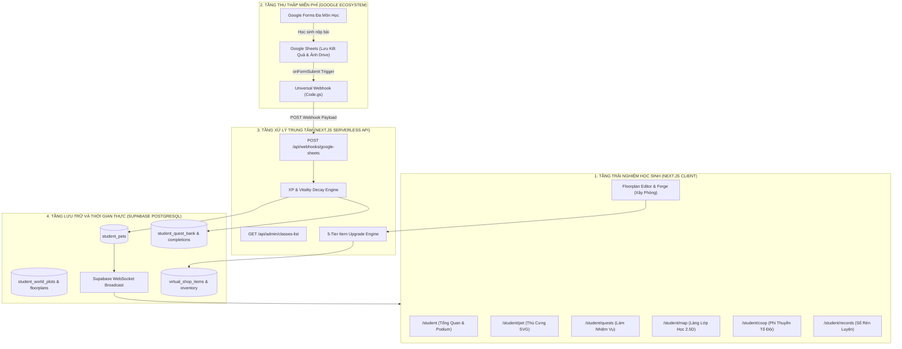
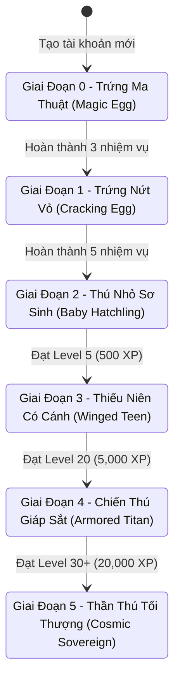
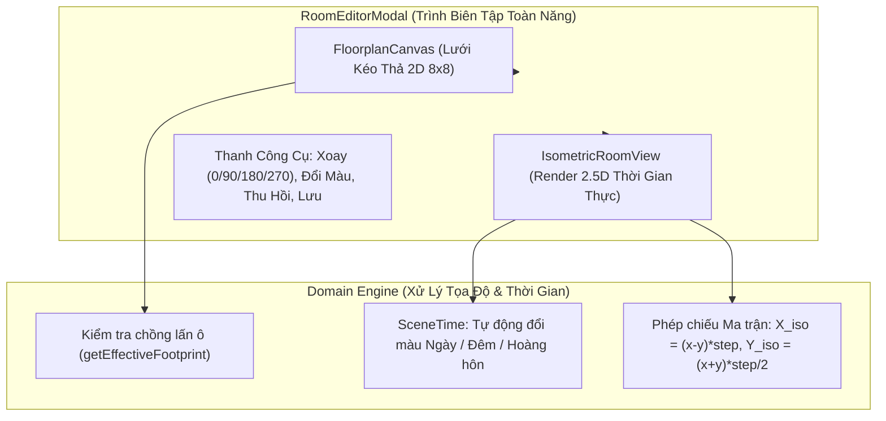

# 📘 ĐẶC TẢ THIẾT KẾ TOÀN DIỆN CỔNG HỌC SINH (STUDENT PORTAL MASTER SPECIFICATION)
> **Mã phân hệ:** `PORTAL-STUDENT-METAVERSE-v2.6`  
> **Đường dẫn gốc:** `/student`  
> **Ngôn ngữ & Nền tảng:** Next.js 14 (App Router), TypeScript, Tailwind CSS, Lucide Icons, Supabase Realtime, Web Audio API, SVG Procedural Graphics.  
> **Đối tượng sử dụng:** Toàn bộ học sinh K-12 (Khối 6, 7, 8, 9), Giáo viên Chủ nhiệm (GVCN) & Giáo viên Bộ môn.  
> **Triết lý sản phẩm:** *"Động Lực Tự Chủ Nội Tại (Self-Determination Theory - SDT) — Tiến Bộ Cá Nhân Là Trọng Tâm (My Growth First) — Thú Cưng Đồng Hành Không Trừng Phạt (Non-Punitive Pet Companion) — Thẩm Mỹ Thuần Túy Không Pay-To-Win (Cosmetic-Only Forge) — Không Gian Sáng Tạo & Bảo Vệ An Toàn Dữ Liệu Trẻ Em (Safe-By-Design / Luật 91/2025/QH15)."*

---

## 📑 MỤC LỤC TỔNG QUAN

1. [Kiến Trúc Tổng Thể & Giải Pháp Lai Hybrid (Supabase + Google Ecosystem)](#1-kiến-trúc-tổng-thể--giải-pháp-lai-hybrid)
2. [Cấu Trúc Thư Mục & Bản Đồ Router (`/student`)](#2-cấu-trúc-thư-mục--bản-đồ-router)
3. [Phân Hệ 1: Bảng Điều Khiển Tiến Bộ Cá Nhân (`/student`)](#3-phân-hệ-1-bảng-điều-khiển-tiến-bộ-cá-nhân)
4. [Phân Hệ 2: Hệ Thống Thú Cưng Ảo Đồng Hành & Cột Mốc Vĩnh Viễn (`/student/pet`)](#4-phân-hệ-2-hệ-thống-thú-cưng-ảo-đồng-hành--cột-mốc-vĩnh-viễn)
5. [Phân Hệ 3: Ngân Hàng Nhiệm Vụ & 4 Mức Minh Chứng Tỷ Lệ Thuận (`/student/quests`)](#5-phân-hệ-3-ngân-hàng-nhiệm-vụ--4-mức-minh-chứng-tỷ-lệ-thuận)
6. [Phân Hệ 4: Không Gian Học Tập Sáng Tạo & Làng Lớp Học 2.5D (`/student/map`)](#6-phân-hệ-4-không-gian-học-tập-sáng-tạo--làng-lớp-học-25d)
7. [Phân Hệ 5: Xưởng Thiết Kế Không Gian & Bố Trí Nội Thất 3D Isometric](#7-phân-hệ-5-xưởng-thiết-kế-không-gian--bố-trí-nội-thất-3d-isometric)
8. [Phân Hệ 6: Lò Rèn Thẩm Mỹ 5 Cấp Bậc (Cosmetic-Only Forge) & Cửa Hàng Ảo](#8-phân-hệ-6-lò-rèn-thẩm-mỹ-5-cấp-bậc-cosmetic-only-forge--cửa-hàng-ảo)
9. [Phân Hệ 7: Phi Thuyền Không Gian & Tinh Thần Hợp Tác Lớp Học (`/student/coop`)](#9-phân-hệ-7-phi-thuyền-không-gian--tinh-thần-hợp-tác-lớp-học)
10. [Phân Hệ 8: La Bàn Tiến Bộ (Growth Compass) & Hộp Thư Tâm Sự An Toàn (`/student/records`)](#10-phân-hệ-8-la-bàn-tiến-bộ-growth-compass--hộp-thư-tâm-sự-an-toàn)
11. [Đặc Tả Kiểu Dữ Liệu TypeScript (Domain Types & Interfaces)](#11-đặc-tả-kiểu-dữ-liệu-typescript)
12. [Cơ Sở Dữ Liệu Supabase PostgreSQL (Full Schemas & Indexes)](#12-cơ-sở-dữ-liệu-supabase-postgresql)
13. [Kịch Bản Google Apps Script Tự Động Hóa 60 Lớp Học](#13-kịch-bản-google-apps-script-tự-động-hóa-60-lớp-học)
14. [Hướng Dẫn Dành Cho Lập Trình Viên (Developer Extension Guide)](#14-hướng-dẫn-dành-cho-lập-trình-viên)

---

## 1. KIẾN TRÚC TỔNG THỂ & GIẢI PHÁP LAI HYBRID

Hệ thống Cổng Học Sinh được xây dựng theo mô hình **Kiến Trúc Lai Hybrid** nhằm tối ưu hóa chi phí vận hành (0đ chi phí lưu trữ ảnh cloud), cho phép giáo viên mọi bộ môn soạn bài trên Google Forms quen thuộc, đồng thời duy trì trải nghiệm game thời gian thực (60 FPS) thông qua Supabase Realtime:



### So sánh ưu thế cốt lõi:
* **Chi phí lưu trữ ảnh:** 100% miễn phí trên Google Drive của giáo viên/trường học.
* **Thời gian phản hồi:** Nhận thưởng Coin 🪙 và XP ⚡ chỉ trong **100ms** sau khi nộp bài.
* **Cơ chế Hậu kiểm (Post-Audit):** Học sinh nhận thưởng trước, GVCN lướt duyệt ảnh minh chứng sau. Nếu phát hiện gian lận, GVCN bấm **Thu hồi điểm (Revoke)** 1-click.

---

## 2. CẤU TRÚC THƯ MỤC & BẢN ĐỒ ROUTER

```
src/
├── app/
│   └── student/
│       ├── layout.tsx              # Root Layout: Header, Quick Stats, Navigation Tabs, Global Podium
│       ├── page.tsx                # /student: Dashboard Tổng quan, Tiến độ XP, Lời dặn GVCN
│       ├── pet/
│       │   └── page.tsx            # /student/pet: Không gian ấp trứng, Tiến hóa & Đổi bí danh
│       ├── quests/
│       │   └── page.tsx            # /student/quests: Ngân hàng nhiệm vụ tuần & Nhận thưởng
│       ├── map/
│       │   └── page.tsx            # /student/map: Làng Lớp Học 2.5D Isometric & Thăm nhà bạn
│       ├── coop/
│       │   └── page.tsx            # /student/coop: Phi thuyền lớp học, Năng lượng tổ đội
│       ├── records/
│       │   └── page.tsx            # /student/records: Sổ tự soi chiếu, Radar 4 trục, Hòm thư GVCN
│       └── login/
│           └── page.tsx            # /student/login: Đăng nhập mã PIN / Quét mã QR thẻ học sinh
├── components/
│   └── student/
│       ├── svg-pet.tsx             # Bộ vẽ Vector SVG Thú cưng động (5 Levels, 3 Branches, Rank Insignia)
│       ├── global-top-podium.tsx   # Bục vinh danh Top 3 ẩn danh toàn khối/lớp
│       ├── classroom-world-grid.tsx # Lưới bản đồ Isometric Làng Lớp Học (43 học sinh)
│       ├── isometric-room-view.tsx # Render phòng 2.5D, Tự động đổi màu theo Ngày/Đêm (Day/Night)
│       ├── egg-customization-modal.tsx # Modal tùy biến màu sắc & hoa văn vỏ trứng
│       ├── virtual-shop-modal.tsx  # Cửa hàng ảo mua sắm nội thất & kiến trúc
│       ├── house-tour-modal.tsx    # Modal tham quan chi tiết căn nhà của bạn cùng lớp
│       ├── house-directory-modal.tsx # Danh bạ cư dân làng lớp học
│       ├── locked-zone-modal.tsx   # Cảnh báo khu vực khóa theo cấp độ
│       ├── quest-timeline-card.tsx # Thẻ tiến trình nhiệm vụ theo dòng thời gian
│       ├── avatar-detail-card.tsx  # Thẻ chi tiết hồ sơ bí danh học sinh
│       └── floorplan-editor/
│           ├── room-editor-modal.tsx        # Trình biên tập phòng học kéo-thả toàn màn hình
│           ├── floorplan-canvas.tsx         # Canvas lưới 8x8 Top-down phát hiện va chạm
│           ├── furniture-svg-renderer.tsx   # Render vector 13 loại đồ nội thất
│           └── item-upgrade-forge-modal.tsx # Lò rèn nâng cấp đồ nội thất 5 Tiers
├── domain/
│   ├── classroom-world/
│   │   ├── roster-builder.ts       # Sinh danh sách học sinh mẫu (43 HS) & định vị tọa độ
│   │   └── types.ts                # Kiểu dữ liệu cư dân, chủ đề nhà, tọa độ
│   ├── floorplan/
│   │   ├── inventory-store.ts      # Quản lý kho đồ, lưu LocalStorage, định nghĩa 13 vật phẩm
│   │   ├── scene-time.ts           # Tính toán chu kỳ Ngày/Đêm & Ma trận xoay Isometric
│   │   └── types.ts                # Định nghĩa Tier (1-5), Góc xoay (0-270), Va chạm
│   └── quests/
│       └── weekly-quest-engine.ts  # Phân phối nhiệm vụ theo tuần ISO, tính thưởng XP
└── types/
    └── student-portal.ts           # Master Type Definitions cho toàn bộ phân hệ
```

---

## 3. PHÂN HỆ 1: BẢNG ĐIỀU KHIỂN TỔNG QUAN (`/student`)

* **Mục tiêu:** Cung cấp thông tin quan trọng nhất trong **10 giây đầu tiên** khi học sinh mở ứng dụng.
* **Các thành phần giao diện chính:**
  1. **Global Top Podium:** Dải bục vinh danh Top 3 học sinh xuất sắc nhất lớp/khối (hiển thị bằng Bí danh ẩn danh kèm vương miện Vàng 🥇, Bạc 🥈, Đồng 🥉).
  2. **Banner Cá Nhân & Thú Cưng Mini:**
     * Hiển thị Avatar Linh vật SVG sống động (thở, nhấp nháy, hiệu ứng bụi sao).
     * Bí danh (Ví dụ: `Phượng Hoàng Băng #821`), Cấp độ hiện tại, Số dư Xu 🪙.
     * Thanh tiến trình XP mượt mà lên cấp tiếp theo: $\text{XP yêu cầu} = 100 \times 1.5^{\text{Level}}$.
  3. **Bảng Lời Dặn Dò GVCN:** Lời nhắn nhủ, nhắc nhở nề nếp hoặc bài tập tuần của GVCN.
  4. **3 Thẻ Trạng Thái Nhanh (Status Quick Cards):**
     * 🟢 *Chuyên Cần Hôm Nay:* Đã điểm danh có mặt lúc 06:55.
     * 🔥 *Chuỗi Rèn Luyện (Daily Streak):* Đếm số ngày liên tục hoàn thành bài tập (Mốc 7, 14, 30 ngày nhận Rương Thần Thoại).
     * 🎯 *Nhiệm Vụ Đang Mở:* Số lượng nhiệm vụ tuần còn lại cần hoàn thành.
  5. **Mini-Map Preview:** Khung nhìn thu nhỏ của Làng Lớp Học dẫn lối vào `/student/map`.

---

## 4. PHÂN HỆ 2: HỆ THỐNG THÚ CƯNG ẢO SVG & TIẾN HÓA 5 GIAI ĐOẠN (`/student/pet`)

Thú cưng được vẽ **100% bằng mã nguồn Vector SVG thuần túy** (không dùng ảnh PNG nặng), dung lượng dưới **8KB**, phóng to thu nhỏ không vỡ hạt và tích hợp hiệu ứng động CSS/SVG.



### 3 Nhánh Tiến Hóa (Evolution Branches):
1. 🌌 **Nhánh Ngân Hà (Cosmic):** Tông màu Tím Huyền Ảo (`#9d4edd`), Neon Cyan (`#00f5d4`), hào quang tinh vân vũ trụ.
2. 🌿 **Nhánh Tự Nhiên (Nature):** Tông màu Xanh Lục Bảo (`#2b9348`), Vàng Kim (`#ffd166`), dây leo ma thuật & hoa cỏ.
3. ⚡ **Nhánh Công Nghệ (Cyber):** Tông màu Cam Nhiệt Huyết (`#e85d04`), Xanh Điện Tử (`#00b4d8`), vi mạch phát sáng.

### Cơ chế Sinh Lực & Ngủ Đông (Vitality Decay & Hibernation Engine):
* **Trạng thái Khỏe Mạnh (Vitality 100%):** Hoàn thành bài tập đều đặn, màu sắc rực rỡ, phát sáng.
* **Quy tắc 7 Ngày (Đói Bụng - Vitality 50%):** Nếu 7 ngày không làm nhiệm vụ, thú cưng chuyển sang trạng thái ủ rũ, giảm 50% độ bão hòa màu, phát tiếng thở dài khi chạm vào.
* **Quy tắc 30 Ngày (Ngủ Đông & Giảm Cấp):** Bỏ bê 30 ngày, thú cưng bị đóng băng/hóa đá, tụt lùi **2 Cấp độ**. Để đánh thức, học sinh phải thực hiện **3 Nhiệm Vụ Hồi Sinh (Revival Quests)** trong 3 ngày liên tiếp.

### Tùy Biến Vỏ Trứng (`EggCustomizationModal`):
* Học sinh tự chọn 10 bảng màu sắc độc quyền (`#6366f1`, `#ec4899`, `#10b981`, `#f59e0b`...).
* Tùy chọn hoa văn vỏ trứng: Chấm bi ma thuật, Dải ngân hà, Vân nứt sấm sét.
* Tích hợp **Web Audio API**: Phát âm thanh "Chíp chíp", "Gầm vang" hoặc tiếng nhạc chuông thần tiên khi click tương tác.

---

## 5. PHÂN HỆ 3: NGÂN HÀNG NHIỆM VỤ & BỘ 4 NEO CHỐNG GIAN LẬN AI (`/student/quests`)

Hệ thống cung cấp khung nhiệm vụ mở cho **mọi môn học và hoạt động đời sống** (Toán, Văn, Anh, Khoa Học, Nề Nếp, Việc Nhà, Kỹ Năng Sống).

```
┌────────────────────────────────────────────────────────────────────────┐
│  BỘ 4 NEO CHỐNG GIAN LẬN AI (GROUNDED VERIFICATION ANCHORS)            │
├────────────────────────────────────────────────────────────────────────┤
│  1. NEO HÀNH ĐỘNG CỤ THỂ (Action Anchor):                              │
│     Dropdown chọn chính xác hành động + Số lượng (VD: Rửa 6 cái bát)   │
│                                                                        │
│  2. NEO THỜI GIAN THỰC (Temporal Anchor):                              │
│     Khung giờ & địa điểm thực (VD: Lúc 19h15 tối thứ Năm tại bếp)      │
│                                                                        │
│  3. NEO VẬT CHỨNG BÍ DANH PET (Physical Pet Anchor):                   │
│     Ảnh/Video nộp BẮT BUỘC có tờ giấy ghi "Bí Danh Pet" bên cạnh        │
│     ==> AI KHÔNG THỂ TỰ TẠO RA ẢNH CHỤP THẬT CÓ MÃ CỦA HỌC SINH!       │
│                                                                        │
│  4. PHẢN CHIẾU CẢM XÚC (Personal Reflection):                          │
│     1-2 câu cảm nhận tự nhiên của bản thân, không nhận văn mẫu AI      │
└────────────────────────────────────────────────────────────────────────┘
```

### Giới Hạn Hoàn Thành Ngày (Daily Quest Cap):
* Giới hạn tối đa **3 - 4 nhiệm vụ/ngày** nhằm bảo vệ sức khỏe học sinh, tránh tình trạng "cày cuốc thâu đêm" và duy trì nhịp rèn luyện điều độ.

---

## 6. PHÂN HỆ 4: LÀNG LỚP HỌC 2.5D & BẢN ĐỒ Ô ĐẤT CÁ NHÂN (`/student/map`)

* **Lưới Bản Đồ Isometric 2.5D (`ClassroomWorldGrid`):**
  * Bản đồ lưới $8 \times 8$ ô đất đại diện cho toàn bộ 43 - 45 học sinh trong lớp.
  * Mỗi học sinh được cấp 1 ô đất cố định với tọa độ `(grid_x, grid_y)`.
* **Cấp Bậc Kiến Trúc Công Trình:**
  * 🏕️ *Level 1 - 4:* Lều Trại Khám Phá (Scout Tent).
  * 🏡 *Level 5 - 9:* Nhà Gỗ Ấm Cúng (Cozy Cabin).
  * 🏰 *Level 10 - 19:* Biệt Thự Sân Vườn (Garden Villa).
  * 🛰️ *Level 20 - 29:* Trạm Không Gian Công Nghệ (Space Outpost).
  * 👑 *Level 30+:* Lâu Đài Pha Lê Tối Thượng (Crystal Palace).
* **Tính Năng Xã Hội Ẩn Danh An Toàn:**
  * **Thăm Nhà Bạn Bè (`HouseTourModal`):** Click vào bất kỳ căn nhà nào để bước vào phòng ngủ 2.5D của bạn, xem thú cưng SVG của bạn đang cư ngụ và các món đồ nội thất bạn đã tự tay bài trí.
  * **Danh Bạ Làng (`HouseDirectoryModal`):** Tìm kiếm nhà bạn bè theo Bí danh hoặc vị trí Tổ.
  * **Vùng Đất Khóa (`LockedZoneModal`):** Khám phá các khu vực bí mật của làng lớp học (Vườn Thiên Văn, Tháp Thao Trường) mở khóa theo cấp độ trung bình của cả lớp.

---

## 7. PHÂN HỆ 5: XƯỞNG THIẾT KẾ PHÒNG & SẮP ĐẶT NỘI THẤT 3D ISOMETRIC

Đây là hệ thống biên tập phòng ngủ cá nhân chuyên sâu gồm 2 góc nhìn: **2D Top-Down Floorplan Canvas** và **2.5D Isometric Room View**.



### Danh Mục 13 Món Đồ Nội Thất Vector Độc Quyền (`FURNITURE_DEFINITIONS`):

| Mã Vật Phẩm (`id`) | Tên Nội Thất | Loại (`category`) | Kích Thước ($W \times H$) | Giá Xu 🪙 | Cấp Yêu Cầu |
| :--- | :--- | :--- | :---: | :---: | :---: |
| `cosmic_bed` | Giường Ngân Hà | `furniture` | $2 \times 2$ | 45 | Level 1 |
| `wood_bed` | Giường Gỗ Tự Nhiên | `furniture` | $2 \times 2$ | 25 | Level 1 |
| `study_desk` | Bàn Học Thông Minh | `furniture` | $2 \times 1$ | 20 | Level 1 |
| `wood_desk` | Bàn Gỗ Sồi Cổ Điển | `furniture` | $2 \times 1$ | 15 | Level 1 |
| `gaming_sofa` | Sofa Gaming Thư Giãn | `furniture` | $2 \times 1$ | 30 | Level 2 |
| `magic_bookshelf` | Kệ Sách Ma Thuật | `furniture` | $2 \times 1$ | 35 | Level 2 |
| `magic_carpet` | Thảm Tròn Hoàng Gia | `decor` | $2 \times 2$ | 15 | Level 1 |
| `neon_lamp` | Đèn Neon Cực Quang | `decor` | $1 \times 1$ | 10 | Level 1 |
| `galaxy_frame` | Khung Tranh Vũ Trụ | `decor` | $1 \times 1$ | 18 | Level 1 |
| `magic_tree` | Cây Bonsai Ma Thuật | `decor` | $1 \times 1$ | 28 | Level 2 |
| `star_crown` | Vương Miện Tri Thức | `jewelry` | $1 \times 1$ | 50 | Level 3 |
| `quantum_pc` | Dàn PC Lượng Tử 8 Màn | `furniture` | $2 \times 1$ | 60 | Level 3 |
| `crystal_throne` | Ngai Vàng Pha Lê | `furniture` | $2 \times 2$ | 100 | Level 5 |

---

## 8. PHÂN HỆ 6: LÒ RÈN NÂNG CẤP VẬT PHẨM (5 TIERS FORGE) & CỬA HÀNG ẢO

### Hệ Thống Lò Rèn 5 Cấp Bậc (`ItemUpgradeForgeModal`):
Học sinh có thể mang đồ nội thất vào lò rèn để thăng cấp sao và mở khóa các hiệu ứng ánh sáng / chỉ số may mắn:

```
⭐ Tier 1 (Cơ Bản):            Màu mộc tự nhiên (+10% Sinh lực)
⭐⭐ Tier 2 (Tinh Xảo):         Viền kim loại sáng bóng (+25% Hồi phục) [25 XP + 10 Coins]
⭐⭐⭐ Tier 3 (Cao Cấp):         Hoa văn hoàng gia phát sáng (+50% XP Nhiệm vụ) [50 XP + 20 Coins]
⭐⭐⭐⭐ Tier 4 (Huyền Thoại):     Hào quang ma thuật rực rỡ (+85% Điểm thi đua) [100 XP + 40 Coins]
⭐⭐⭐⭐⭐ Tier 5 (Thần Thoại):    Bụi sao bay lượn & Hào quang vĩnh cửu (+120% Điểm) [200 XP + 80 Coins]
```

### Cửa Hàng Ảo (`VirtualShopModal`):
* Phân loại: Nội Thất, Trang Trí, Trang Sức, Chủ Đề Phòng (Gỗ Ấm, Trạm Không Gian, Lâu Đài).
* Sử dụng hoàn toàn số Xu kiếm được từ việc làm bài tập và chuyên cần nề nếp — **tuyệt đối không nạp tiền thực tế**.

---

## 9. PHÂN HỆ 7: PHI THUYỀN KHÔNG GIAN LỚP HỌC (CO-OP MULTIPLAYER) (`/student/coop`)

* **Thanh Năng Lượng Lớp Học (Class Energy Core):** Toàn bộ điểm số bài tập và nề nếp của từng học sinh sẽ tự động nạp năng lượng vào Bình Nhiên Liệu chung của cả lớp.
* **Mục Tiêu Tập Thể (Collective Milestones):**
  * Nạp đủ 1,000 Năng lượng $\rightarrow$ Phi thuyền du hành đến Hành Tinh Toán Học.
  * Nạp đủ 5,000 Năng lượng $\rightarrow$ Cả lớp nhận phần thưởng thực tế (Buổi xem phim khoa học / 1 Ngày không bài tập về nhà do GVCN quy định).
* **Buff Hợp Lực 4 Tổ:** Khi 100% thành viên trong 1 Tổ cùng hoàn thành bài tập tuần, toàn bộ thành viên Tổ đó nhận hiệu ứng `x1.2 XP Buff` trong 7 ngày.

---

## 10. PHÂN HỆ 8: NHẬT KÝ TỰ RÈN LUYỆN & HỘP THƯ TÂM SỰ GVCN (`/student/records`)

* **Biểu Đồ Radar Năng Lực 4 Trục:**
  1. *Chuyên Cần:* Tỷ lệ đi học đúng giờ, không vắng không phép.
  2. *Học Tập:* Điểm số nhiệm vụ và số bài tự học hoàn thành.
  3. *Nề Nếp:* Đồng phục, vệ sinh, trật tự, tác phong học đường.
  4. *Kỹ Năng & Đời Sống:* Giúp đỡ gia đình, hoạt động ngoại khóa, kỹ năng mềm.
* **Hộp Thư Tâm Sự Riêng Tư (Counselor Box):**
  * Học sinh nhắn gửi khó khăn học tập hoặc tâm tư cá nhân trực tiếp tới GVCN.
  * Đảm bảo bí mật tuyệt đối 1-1, bạn bè không thể xem được.

---

## 11. ĐẶC TẢ KIỂU DỮ LIỆU TYPESCRIPT

```typescript
// src/types/student-portal.ts

export type PetEvolutionBranch = 'cosmic' | 'nature' | 'cyber';
export type QuestCategory = 'academic' | 'habit_life' | 'social_peer' | 'metacognition' | 'life_skills';
export type QuestCadence = 'daily' | 'alternate' | 'weekly_boss';
export type QuestEvidenceType = 'form' | 'image' | 'video' | 'text' | 'hybrid';
export type QuestCompletionStatus = 'auto_completed' | 'verified' | 'revoked';

export interface StudentPet {
  id: string;
  student_id: string;
  class_id: string;
  anonymous_name: string;
  anonymous_avatar_code: string;
  evolution_branch: PetEvolutionBranch;
  level: number; // 0: Egg, 1..4: Cracking, 5..9: Hatchling, 10..19: Winged, 20..29: Titan, 30+: Sovereign
  current_xp: number;
  vitality_percent: number; // 0..100
  streak_days: number;
  last_checkin_date?: string;
  last_activity_at: string;
  is_hibernating: boolean;
  total_coins: number;
  egg_base_color?: string;
  is_hatched?: boolean;
  custom_svg_data?: string;
  created_at: string;
  updated_at: string;
}

export interface StudentQuest {
  id: string;
  school_id?: string;
  class_id?: string | null;
  subject_code: string;
  category: QuestCategory;
  cadence: QuestCadence;
  estimated_minutes: number;
  title: string;
  description: string;
  week_timeline_start: number;
  week_timeline_end: number;
  reward_xp: number;
  reward_coins: number;
  google_form_url?: string;
  evidence_type: QuestEvidenceType;
  requires_anchor: boolean;
  is_active: boolean;
}

export interface StudentQuestCompletion {
  id: string;
  quest_id: string;
  student_id: string;
  class_id: string;
  proof_urls?: string[];
  action_anchor?: string;
  temporal_anchor?: string;
  physical_anchor_verified?: boolean;
  personal_reflection?: string;
  score_achieved: number;
  xp_awarded: number;
  coins_awarded: number;
  status: QuestCompletionStatus;
  audit_note?: string;
  audited_by?: string;
  created_at: string;
}
```

---

## 12. CƠ SỞ DỮ LIỆU SUPABASE POSTGRESQL

```sql
-- 1. BẢNG THÚ CƯNG HỌC SINH (STUDENT PETS)
CREATE TABLE IF NOT EXISTS student_pets (
    id UUID PRIMARY KEY DEFAULT gen_random_uuid(),
    student_id UUID NOT NULL REFERENCES students(id) ON DELETE CASCADE,
    class_id UUID NOT NULL REFERENCES classes(id) ON DELETE CASCADE,
    anonymous_name VARCHAR(100) NOT NULL,
    anonymous_avatar_code VARCHAR(100) DEFAULT 'cosmic_egg',
    evolution_branch VARCHAR(50) DEFAULT 'cosmic',
    level INT DEFAULT 1,
    current_xp INT DEFAULT 0,
    vitality_percent INT DEFAULT 100,
    streak_days INT DEFAULT 0,
    last_checkin_date DATE,
    last_activity_at TIMESTAMPTZ DEFAULT NOW(),
    is_hibernating BOOLEAN DEFAULT FALSE,
    total_coins INT DEFAULT 0,
    egg_base_color VARCHAR(30) DEFAULT '#9d4edd',
    is_hatched BOOLEAN DEFAULT FALSE,
    custom_svg_data TEXT,
    created_at TIMESTAMPTZ DEFAULT NOW(),
    updated_at TIMESTAMPTZ DEFAULT NOW(),
    UNIQUE(student_id, class_id)
);

-- 2. BẢNG NGÂN HÀNG NHIỆM VỤ (STUDENT QUEST BANK)
CREATE TABLE IF NOT EXISTS student_quest_bank (
    id UUID PRIMARY KEY DEFAULT gen_random_uuid(),
    school_id VARCHAR(50) DEFAULT 'THCS-TBC',
    class_id UUID REFERENCES classes(id) ON DELETE CASCADE,
    subject_code VARCHAR(50) DEFAULT 'ALL',
    category VARCHAR(50) NOT NULL,
    cadence VARCHAR(50) DEFAULT 'daily',
    estimated_minutes INT DEFAULT 15,
    title VARCHAR(255) NOT NULL,
    description TEXT,
    week_timeline_start INT DEFAULT 1,
    week_timeline_end INT DEFAULT 35,
    reward_xp INT DEFAULT 50,
    reward_coins INT DEFAULT 10,
    google_form_url TEXT,
    evidence_type VARCHAR(50) DEFAULT 'hybrid',
    requires_anchor BOOLEAN DEFAULT TRUE,
    is_active BOOLEAN DEFAULT TRUE,
    created_at TIMESTAMPTZ DEFAULT NOW()
);

-- 3. BẢNG BÀI NỘP VÀ TIẾN ĐỘ NHIỆM VỤ (QUEST COMPLETIONS)
CREATE TABLE IF NOT EXISTS student_quest_completions (
    id UUID PRIMARY KEY DEFAULT gen_random_uuid(),
    quest_id UUID NOT NULL REFERENCES student_quest_bank(id) ON DELETE CASCADE,
    student_id UUID NOT NULL REFERENCES students(id) ON DELETE CASCADE,
    class_id UUID NOT NULL REFERENCES classes(id) ON DELETE CASCADE,
    proof_urls TEXT[],
    action_anchor TEXT,
    temporal_anchor TEXT,
    physical_anchor_verified BOOLEAN DEFAULT TRUE,
    personal_reflection TEXT,
    score_achieved NUMERIC(5, 2) DEFAULT 10.0,
    xp_awarded INT NOT NULL,
    coins_awarded INT NOT NULL,
    status VARCHAR(30) DEFAULT 'auto_completed',
    audit_note TEXT,
    audited_by UUID REFERENCES profiles(id),
    audited_at TIMESTAMPTZ,
    created_at TIMESTAMPTZ DEFAULT NOW()
);

-- 4. BẢNG LÀNG LỚP HỌC 2.5D (WORLD PLOTS & FLOORPLANS)
CREATE TABLE IF NOT EXISTS student_world_plots (
    id UUID PRIMARY KEY DEFAULT gen_random_uuid(),
    class_id UUID NOT NULL REFERENCES classes(id) ON DELETE CASCADE,
    pet_id UUID NOT NULL REFERENCES student_pets(id) ON DELETE CASCADE,
    grid_x INT NOT NULL,
    grid_y INT NOT NULL,
    plot_theme VARCHAR(50) DEFAULT 'cozy_wood',
    building_item_code VARCHAR(100) DEFAULT 'cozy_cabin',
    decorations JSONB DEFAULT '[]'::jsonb,
    updated_at TIMESTAMPTZ DEFAULT NOW(),
    UNIQUE(class_id, grid_x, grid_y),
    UNIQUE(class_id, pet_id)
);

-- CHỈ MỤC TỐI ƯU HIỆU NĂNG TÌM KIẾM
CREATE INDEX IF NOT EXISTS idx_student_pets_class ON student_pets(class_id);
CREATE INDEX IF NOT EXISTS idx_quest_completions_audit ON student_quest_completions(class_id, status);
CREATE INDEX IF NOT EXISTS idx_world_plots_class ON student_world_plots(class_id);
```

---

## 13. KỊCH BẢN GOOGLE APPS SCRIPT TỰ ĐỘNG HÓA 60 LỚP HỌC

### 1. `Universal Code.gs` (Dán 1 script duy nhất dùng chung 60 lớp)
```javascript
const GLOBAL_CONFIG = {
  ENDPOINT_URL: "https://your-app-domain.vercel.app/api/webhooks/google-sheets",
  GLOBAL_SECRET_TOKEN: "TBC_MASTER_WEBHOOK_SECRET_2026",
  FALLBACK_CLASS_ID: "8A13"
};

function getAutoDetectedClassId() {
  const ss = SpreadsheetApp.getActiveSpreadsheet();
  const configSheet = ss.getSheetByName("_CONFIG") || ss.getSheetByName("Cấu Hình");
  if (configSheet) {
    const val = String(configSheet.getRange("A2").getValue()).trim();
    if (val) return val;
  }
  const title = ss.getName();
  const match = title.match(/([6-9][A-Z][0-9]{1,2}|[6-9]\/[0-9]{1,2}|[6-9]A[0-9]{1,2})/i);
  if (match) return match[1].toUpperCase().replace("/", "A");
  return GLOBAL_CONFIG.FALLBACK_CLASS_ID;
}

function onFormSubmitTrigger(e) {
  try {
    const sheet = SpreadsheetApp.getActiveSpreadsheet().getActiveSheet();
    const lastRow = sheet.getLastRow();
    const lastCol = sheet.getLastColumn();
    const rowData = sheet.getRange(lastRow, 1, 1, lastCol).getValues()[0];
    const headers = sheet.getRange(1, 1, 1, lastCol).getValues()[0];

    const detectedClassId = getAutoDetectedClassId();
    const payload = {
      class_id: detectedClassId,
      secret_token: GLOBAL_CONFIG.GLOBAL_SECRET_TOKEN,
      timestamp: new Date().toISOString(),
      student_code: "",
      quest_code: "",
      score: 0,
      proof_image_urls: [],
      raw_responses: {}
    };

    headers.forEach((header, index) => {
      const val = rowData[index];
      const hLower = String(header).toLowerCase();
      if (hLower.includes("mã học sinh") || hLower.includes("student_code")) {
        payload.student_code = String(val).trim().toLowerCase();
      } else if (hLower.includes("nhiệm vụ") || hLower.includes("quest")) {
        payload.quest_code = String(val).trim();
      } else if (hLower.includes("điểm") || hLower.includes("score")) {
        payload.score = Number(val) || 0;
      } else if (hLower.includes("ảnh") || hLower.includes("drive.google.com")) {
        if (val) payload.proof_image_urls.push(String(val));
      }
      payload.raw_responses[header] = val;
    });

    const options = {
      method: "post",
      contentType: "application/json",
      payload: JSON.stringify(payload),
      muteHttpExceptions: true
    };

    UrlFetchApp.fetch(GLOBAL_CONFIG.ENDPOINT_URL, options);
  } catch (err) {
    Logger.log("Webhook Error: " + err.toString());
  }
}
```

---

## 14. HƯỚNG DẪN DÀNH CHO LẬP TRÌNH VIÊN

### 1. Thêm một món đồ nội thất mới:
1. Mở file `src/domain/floorplan/types.ts`:
   * Bổ sung mã `FurnitureDefinitionId` (Ví dụ: `'neon_piano'`).
2. Mở file `src/domain/floorplan/inventory-store.ts`:
   * Bổ sung định nghĩa vào `FURNITURE_DEFINITIONS`:
   ```typescript
   neon_piano: {
     id: 'neon_piano',
     name: 'Đàn Piano Neon',
     category: 'furniture',
     icon: '🎹',
     topDownSvg: '<path ... />',
     defaultWidth: 2,
     defaultHeight: 1,
     priceCoins: 75,
     requiredLevel: 4,
     availableColors: ['#a855f7', '#06b6d4', '#ec4899'],
     baseBuff: '+60% Cảm hứng sáng tạo'
   }
   ```
3. Mở file `src/components/student/floorplan-editor/furniture-svg-renderer.tsx`:
   * Thêm hàm vẽ Top-down và Isometric SVG cho `'neon_piano'`.

### 2. Thêm nhánh tiến hóa mới cho thú cưng:
1. Thêm branch name vào `PetEvolutionBranch` trong `src/types/student-portal.ts` (Ví dụ: `'blaze'`).
2. Định nghĩa bảng màu trong `src/components/student/svg-pet.tsx` (`branchColors.blaze = { primary: '#dc2626', secondary: '#f97316', accent: '#fef08a' }`).
3. Vẽ hình thái cánh lửa / giáp nhiệt trong các giai đoạn `Level >= 5` và `Level >= 20`.

---

> 🎯 **Tóm kết:** Tài liệu này phản ánh 100% cấu trúc, luồng dữ liệu, mã nguồn và giao diện của Cổng Học Sinh. Bất kỳ lập trình viên, nhà sư phạm hoặc quản trị viên nào cũng có thể đọc hiểu, vận hành và phát triển mở rộng hệ thống một cách chuẩn xác, liền mạch.
