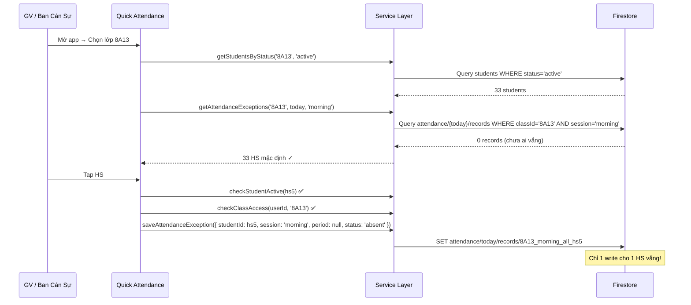

# 🎨 Design Specification: App Điểm Danh v3.0
Created: 2026-02-25
Status: 🟡 Awaiting Review

---

## I. TỔNG QUAN THAY ĐỔI

### Từ v2.0 → v3.0

| Hạng mục | v2.0 (hiện tại) | v3.0 (mới) |
|----------|-----------------|------------|
| **Auth** | PasswordGuard (shared password) | Firebase Auth (email/student code) |
| **Roles** | 3: gvcn, giamthi, bgh | 5: admin, principal, supervisor, teacher, class_monitor |
| **Student status** | 3: 'Đang học', 'Nghỉ học', 'Chuyển trường' | 5: active, temporary_leave, dropped_out, suspended, graduated |
| **Attendance** | Map-based, lưu tất cả HS, theo ngày | Exception-only, theo buổi (+ tiết optional), chỉ lưu vắng/trễ |
| **Timetable** | Không có | Có, Sáng/Chiều, 5 tiết/buổi, nhiều đợt |
| **Firestore path** | `schools/{schoolId}/years/{year}/...` | `years/{year}/...` (bỏ schoolId) |
| **Export** | Excel only | Excel + JSON + ZIP |
| **API** | Không có | REST 9 endpoints |

---

## II. FIRESTORE SCHEMA v3.0

### Sơ đồ tổng quan
```
Root
├── settings/
│   └── app                           # activeYear, schoolName
├── users/{uid}                       # Auth + RBAC
└── years/{year}/
    ├── classes/{classId}             # Thông tin lớp
    ├── students/{studentId}          # HS + status + history
    ├── timetables/{timetableId}      # TKB theo đợt
    ├── attendance/{date}/
    │   └── records/{recordId}        # Chỉ ngoại lệ (vắng/trễ/phép)
    ├── columns/{columnId}            # Column definitions (giữ nguyên v2)
    ├── columnData/{columnId}/
    │   └── records/{key}             # Column data (giữ nguyên v2)
    └── reportPresets/{presetId}      # Saved report configs
```

---

### 1. `settings/app` – Cấu hình hệ thống

```typescript
// Firestore: settings/app
interface AppSettings {
  activeYear: string;           // '2025-2026' – năm học đang hoạt động
  schoolName: string;           // 'THCS Nguyễn Trãi'
  schoolCode?: string;          // 'THCS_NT' – dùng khi export
  periodsPerSession: number;    // 5 – số tiết tối đa mỗi buổi
  createdAt: string;
  updatedAt: string;
}
```

---

### 2. `users/{uid}` – Người dùng + RBAC

```typescript
// Firestore: users/{uid}  (uid = Firebase Auth UID)
type UserRole = 'admin' | 'principal' | 'supervisor' | 'teacher' | 'class_monitor';

interface AppUser {
  uid: string;                  // Firebase Auth UID
  email?: string;               // GV dùng email
  studentCode?: string;         // Ban Cán Sự dùng mã HS làm username
  displayName: string;          // 'Cô Lan', 'Nguyễn Văn A (LT 8A13)'
  role: UserRole;
  assignedClassIds: string[];   // ['8A13'] cho teacher, ['8A1','8A2',...,'8A13'] cho supervisor
  assignedGrade?: string;       // 'grade_8' | 'all' – cho supervisor
  permissions: UserPermissions;
  editWindowMinutes: number;    // 30 | 1440 | -1
  isActive: boolean;
  createdBy?: string;           // UID người tạo
  createdAt: string;
  lastLoginAt?: string;
}

interface UserPermissions {
  canEditAttendance: boolean;
  canEditStudentStatus: boolean;
  canCreateAccounts: boolean;
  canViewAllClasses: boolean;
  canExportData: boolean;
  canManageTimetable: boolean;
  canAccessAPI: boolean;
}
```

**Defaults theo role:**

| Permission | admin | principal | supervisor | teacher | class_monitor |
|-----------|-------|-----------|------------|---------|---------------|
| canEditAttendance | ✅ | ❌ | ✅ | ✅ | ✅ |
| canEditStudentStatus | ✅ | ✅ | ❌ | ✅ (limited) | ❌ |
| canCreateAccounts | ✅ | ✅ | ❌ | ❌ | ❌ |
| canViewAllClasses | ✅ | ✅ | ❌ | ❌ | ❌ |
| canExportData | ✅ | ✅ | ✅ | ✅ | ❌ |
| canManageTimetable | ✅ | ✅ | ❌ | ❌ | ❌ |
| canAccessAPI | ✅ | ✅ | ✅ | ❌ | ❌ |
| **editWindowMinutes** | -1 | -1 | 1440 | 1440 | 30 |

---

### 3. `years/{year}/classes/{classId}` – Lớp học

```typescript
// THAY ĐỔI: thêm actualStudentCount, sessions
interface ClassDoc {
  id: string;                   // '8A13'
  name: string;                 // 'Lớp 8A13'
  grade: number;                // 8
  teacherId: string;            // UID của GVCN
  teacherName: string;
  totalStudents: number;        // Tổng HS ban đầu (import)
  actualStudentCount: number;   // [MỚI] Sĩ số thực tế = active + temp_leave
  femaleCount?: number;
  maleCount?: number;
  classType?: string;           // 'BT' | 'TCH'
  sessions: ('morning' | 'afternoon')[];  // [MỚI] ['morning'] hoặc ['morning','afternoon']
}
```

> **`actualStudentCount`** được cập nhật bởi trigger/service mỗi khi student status thay đổi.

---

### 4. `years/{year}/students/{studentId}` – Học sinh

```typescript
// THAY ĐỔI: mở rộng status, thêm statusHistory
type StudentStatus = 'active' | 'temporary_leave' | 'dropped_out' | 'suspended' | 'graduated';

interface StudentDoc {
  // === Fields hiện tại (giữ nguyên) ===
  id: string;
  code: string;                 // '8A13_01'
  classId: string;
  order: number;
  fullName: string;
  firstName: string;
  lastName: string;
  gender: 'Nam' | 'Nữ';
  birthday: string;
  ethnicity?: string;
  govId?: string;

  // === Fields MỚI ===
  status: StudentStatus;        // Thay thế 'Đang học' | 'Nghỉ học' | 'Chuyển trường'
  statusNote?: string;          // 'Viêm phổi nặng, nhập viện'
  statusDate: string;           // ISO – ngày bắt đầu status hiện tại
  statusExpectedReturn?: string; // ISO – dự kiến quay lại (cho temp_leave)
  statusHistory: StatusChange[];
}

interface StatusChange {
  status: StudentStatus;
  date: string;                 // ISO
  note: string;
  changedBy: string;            // UID
  changedByName: string;
  changedByRole: UserRole;
  decisionNumber?: string;      // Số QĐ (cho dropped_out/suspended)
}
```

**Migration v2 → v3:**
```
Mapping cũ → mới:
  'Đang học'      → 'active'
  'Nghỉ học'      → 'dropped_out'
  'Chuyển trường'  → 'dropped_out' (statusNote = 'Chuyển trường')
  (tất cả)        → statusDate = now, statusHistory = []
```

---

### 5. `years/{year}/timetables/{timetableId}` – Thời Khoá Biểu

```typescript
interface TimetableDoc {
  id: string;                   // Auto-generated
  classId: string;              // '8A13'
  className: string;
  effectiveFrom: string;        // ISO – ngày bắt đầu áp dụng
  effectiveTo: string;          // ISO – ngày kết thúc
  schedule: WeeklySchedule;
  createdBy: string;            // UID
  updatedAt: string;
}

// Lịch tuần
interface WeeklySchedule {
  monday: DaySchedule;
  tuesday: DaySchedule;
  wednesday: DaySchedule;
  thursday: DaySchedule;
  friday: DaySchedule;
  saturday: DaySchedule | null; // null = không học thứ 7
}

// Lịch 1 ngày = Sáng + Chiều
interface DaySchedule {
  morning: PeriodSlot[];        // Tối đa 5 tiết
  afternoon: PeriodSlot[] | null; // null = không học chiều ngày đó
}

// 1 tiết học
interface PeriodSlot {
  period: number;               // 1-5
  subject: string;              // 'Toán'
  subjectCode?: string;         // 'MATH' – cho aggregate
  teacherName: string;          // 'Lê Hạnh Nhàn'
  teacherId?: string;           // UID (optional, có thể chưa map)
  room?: string;                // 'P201'
}
```

**Query logic chọn đợt TKB đúng:**
```typescript
// Service: getTimetableForDate(classId, date)
const timetables = await query(
  collection(db, `years/${year}/timetables`),
  where('classId', '==', classId),
  where('effectiveFrom', '<=', date),
  where('effectiveTo', '>=', date)
);
// Trả về timetable đầu tiên match
```

---

### 6. `years/{year}/attendance/{date}/records/{recordId}` – Điểm danh (MỚI)

```typescript
// CHỈ LƯU NGOẠI LỆ – không lưu 'present'
// recordId = `${classId}_${session}_${period ?? 'all'}_${studentId}`

type AttendanceStatusV3 = 'absent' | 'late' | 'excused';

interface AttendanceRecordV3 {
  id: string;
  classId: string;
  studentId: string;            // Document ID của student
  studentCode: string;          // '8A13_01' – để dễ query
  session: 'morning' | 'afternoon';
  period: number | null;        // null = CẢ BUỔI (99%), 1-5 = tiết cụ thể
  status: AttendanceStatusV3;
  subject?: string;             // Chỉ có khi period != null
  note?: string;                // Lý do vắng
  markedBy: string;             // UID
  markedByRole: UserRole;
  timestamp: string;            // ISO – lúc tạo/sửa
}
```

**So sánh v2 vs v3:**

| Khía cạnh | v2 (hiện tại) | v3 (mới) |
|-----------|---------------|----------|
| Cấu trúc | 1 doc/lớp/ngày chứa Map tất cả HS | 1 doc/HS ngoại lệ |
| Lưu gì | Tất cả (cả present) | Chỉ absent/late/excused |
| Buổi | Không có | morning/afternoon |
| Tiết | Không có | 1-5 hoặc null (cả buổi) |
| Writes/lớp/ngày | ~1 (batch map) | ~2-5 (chỉ HS vắng) |
| Reads | 1 read = toàn bộ lớp | N reads theo filter |

**Migration v2 → v3:**
```
1. Backup toàn bộ Firestore → JSON
2. Với mỗi AttendanceRecord v2:
   - Duyệt map absences
   - Với mỗi studentCode có status != '' && status != 'C':
     → Tạo AttendanceRecordV3 mới với session='morning', period=null
   - Bỏ qua students có status = '' hoặc 'C' (present)
3. Xoá collection attendance cũ
```

---

### 7. `apiKeys/{key}` – API Keys

```typescript
interface ApiKey {
  key: string;                  // Random 32 chars
  name: string;                 // 'Chrome Extension Sổ Báo Bài'
  createdBy: string;            // UID
  permissions: string[];        // ['read:classes', 'read:attendance']
  isActive: boolean;
  lastUsedAt?: string;
  createdAt: string;
}
```

---

### 8. Columns & Records (GIỮ NGUYÊN v2.0)

> Schema Column, DailyRecord, PeriodRecord, OneTimeRecord **không thay đổi**.
> Path chuyển từ `schools/{schoolId}/years/{year}/columns/...` → `years/{year}/columns/...`

---

## III. API CONTRACT

### Base: `/api/v1/`

### Authentication
```
Header: Authorization: Bearer <firebase_id_token>
Hoặc: X-API-Key: <api_key>  (cho Chrome extensions)
```

### Response format
```json
{
  "success": true,
  "data": { ... },
  "meta": { "total": 35, "year": "2025-2026" }
}
```

### Error format
```json
{
  "success": false,
  "error": { "code": "FORBIDDEN", "message": "Bạn không có quyền truy cập lớp này" }
}
```

---

### Phase 06a – MVP Endpoints

#### `GET /api/v1/classes`
> Danh sách lớp theo quyền user

**Response:**
```json
{
  "data": [
    {
      "id": "8A13",
      "name": "Lớp 8A13",
      "grade": 8,
      "teacherName": "Lê Hạnh Nhàn",
      "totalStudents": 35,
      "actualStudentCount": 33,
      "sessions": ["morning", "afternoon"]
    }
  ]
}
```

#### `GET /api/v1/classes/{classId}/students`
> Danh sách HS, có filter status

**Query params:** `?status=active` (default), `?status=all`

**Response:**
```json
{
  "data": [
    {
      "id": "abc123",
      "code": "8A13_01",
      "fullName": "Nguyễn Văn A",
      "gender": "Nam",
      "status": "active"
    }
  ],
  "meta": { "total": 33, "totalIncludeInactive": 35 }
}
```

#### `GET /api/v1/attendance/{date}/{classId}`
> Điểm danh 1 lớp 1 ngày (chỉ ngoại lệ)

**Query params:** `?session=morning` (optional)

**Response:**
```json
{
  "data": {
    "date": "2026-02-25",
    "classId": "8A13",
    "actualStudentCount": 33,
    "exceptions": [
      {
        "studentCode": "8A13_05",
        "studentName": "Trần Thị B",
        "session": "morning",
        "period": null,
        "status": "absent",
        "note": "Ốm"
      }
    ],
    "summary": {
      "present": 31,
      "absent": 1,
      "late": 1,
      "excused": 0
    }
  }
}
```

#### `GET /api/v1/export/json`
> Export full data (Admin only)

**Query params:** `?year=2025-2026`

**Response:** Stream JSON file download (full dump)

---

### Phase 06b – Full Endpoints

#### `GET /api/v1/attendance/{date}`
> Điểm danh toàn trường 1 ngày (theo quyền)

#### `GET /api/v1/reports/summary`
> Query params: `?from=2026-01-01&to=2026-01-31&classIds=8A13,8A14`

#### `GET /api/v1/reports/class/{classId}`
> Query params: `?from=2026-01-01&to=2026-01-31`

#### `GET /api/v1/timetable/{classId}`
> TKB hiện tại (auto chọn đợt đúng)

#### `POST /api/v1/attendance/bulk`
> Nhập điểm danh hàng loạt (cho Chrome ext)

```json
// Request body:
{
  "date": "2026-02-25",
  "classId": "8A13",
  "session": "morning",
  "records": [
    { "studentCode": "8A13_05", "status": "absent", "note": "Ốm" },
    { "studentCode": "8A13_12", "status": "late" }
  ]
}
```

---

## IV. SERVICE LAYER CHANGES

### Middleware bắt buộc

```typescript
// src/services/auth-guard.ts

// Gọi ở mọi service function có liên quan đến class data
async function checkClassAccess(userId: string, classId: string): Promise<void> {
  const user = await getUserProfile(userId);
  if (user.permissions.canViewAllClasses) return; // admin, principal
  if (!user.assignedClassIds.includes(classId)) {
    throw new Error('FORBIDDEN: Không có quyền truy cập lớp này');
  }
}

// Gọi trước khi sửa attendance record
function checkEditWindow(user: AppUser, recordTimestamp: string): void {
  if (user.editWindowMinutes === -1) return; // admin
  const minutesAgo = (Date.now() - new Date(recordTimestamp).getTime()) / 60000;
  if (minutesAgo > user.editWindowMinutes) {
    throw new Error('FORBIDDEN: Đã quá thời gian cho phép sửa');
  }
}

// Gọi trước khi tạo attendance record
async function checkStudentActive(studentId: string): Promise<void> {
  const student = await getStudent(studentId);
  if (student.status !== 'active') {
    throw new Error('FORBIDDEN: Không thể điểm danh cho HS không đang học');
  }
}
```

### DbAdapter v3 (mở rộng)

```typescript
// Thêm vào DbAdapter interface
interface DbAdapter {
  // ... (giữ nguyên methods cũ) ...

  // Users (MỚI)
  getUser(uid: string): Promise<AppUser | null>;
  createUser(user: AppUser): Promise<void>;
  updateUser(uid: string, data: Partial<AppUser>): Promise<void>;
  getUsersByRole(role: UserRole): Promise<AppUser[]>;

  // Student Status (MỚI)
  updateStudentStatus(studentId: string, change: StatusChange): Promise<void>;
  getStudentsByStatus(classId: string, status: StudentStatus): Promise<StudentDoc[]>;

  // Timetable (MỚI)
  getTimetable(classId: string, date: string): Promise<TimetableDoc | null>;
  saveTimetable(timetable: TimetableDoc): Promise<void>;
  getTimetablesByClass(classId: string): Promise<TimetableDoc[]>;

  // Attendance v3 (MỚI – thay thế v2)
  getAttendanceExceptions(classId: string, date: string, session?: string): Promise<AttendanceRecordV3[]>;
  saveAttendanceException(record: AttendanceRecordV3): Promise<void>;
  deleteAttendanceException(recordId: string): Promise<void>;

  // API Keys (MỚI)
  getApiKey(key: string): Promise<ApiKey | null>;
  createApiKey(apiKey: ApiKey): Promise<void>;
}
```

---

## V. DATA FLOW

### Flow 1: Điểm danh buổi sáng (99% use case)



### Flow 2: Lớp học cả Sáng lẫn Chiều

```
Sáng 7:00 → GV mở 8A13 → UI hiển thị selector [Sáng ●] [Chiều ○]
  → Điểm danh buổi sáng (session='morning')

Chiều 13:30 → GV mở lại 8A13 → UI auto chọn [Chiều ●]
  → Điểm danh buổi chiều (session='afternoon')
  → Mỗi buổi là 1 set records riêng, không đè lên nhau
```

### Flow 3: HS vắng 1 tiết cá biệt (1% use case)

```
GV tap nút nhỏ "Theo tiết" → Chọn tiết 3
  → saveAttendanceException({ session:'morning', period: 3, subject:'Anh' })
  → Record ID: 8A13_morning_3_hs5
  → HS #5 vẫn present các tiết khác (không có record = có mặt)
```

---

## VI. FIRESTORE SECURITY RULES

```javascript
rules_version = '2';
service cloud.firestore {
  match /databases/{database}/documents {

    // Helper functions
    function getUser() {
      return get(/databases/$(database)/documents/users/$(request.auth.uid)).data;
    }
    function isAdmin() { return getUser().role == 'admin'; }
    function isPrincipal() { return getUser().role == 'principal'; }
    function canViewAll() { return isAdmin() || isPrincipal(); }
    function canViewClass(classId) {
      return canViewAll() || classId in getUser().assignedClassIds;
    }
    function canEditClass(classId) {
      let user = getUser();
      return isAdmin() ||
        (user.role in ['teacher', 'supervisor', 'class_monitor']
         && classId in user.assignedClassIds
         && user.permissions.canEditAttendance == true);
    }

    // Settings
    match /settings/{doc} {
      allow read: if request.auth != null;
      allow write: if isAdmin();
    }

    // Users
    match /users/{uid} {
      allow read: if request.auth != null;
      allow write: if isAdmin() || isPrincipal();
    }

    // Classes
    match /years/{year}/classes/{classId} {
      allow read: if canViewClass(classId);
      allow write: if isAdmin() || isPrincipal();
    }

    // Students
    match /years/{year}/students/{studentId} {
      allow read: if canViewClass(resource.data.classId);
      allow write: if isAdmin() || isPrincipal() ||
        (getUser().role == 'teacher' && resource.data.classId in getUser().assignedClassIds);
    }

    // Timetables
    match /years/{year}/timetables/{timetableId} {
      allow read: if canViewClass(resource.data.classId);
      allow write: if isAdmin() || isPrincipal();
    }

    // Attendance (chỉ ngoại lệ)
    match /years/{year}/attendance/{date}/records/{recordId} {
      allow read: if canViewClass(resource.data.classId);
      allow create: if canEditClass(request.resource.data.classId);
      allow update: if canEditClass(resource.data.classId);
      allow delete: if isAdmin();
    }

    // API Keys
    match /apiKeys/{key} {
      allow read, write: if isAdmin();
    }
  }
}
```

---

## VII. EXCEL IMPORT TEMPLATES

### Template A: TKB Pivot (cho GV/Admin)

```
Sheet: TKB_8A13

| Lớp: 8A13          | Áp dụng từ: 23/02/2026  | Đến: 01/03/2026 |
|---------------------|--------------------------|------------------|
| Buổi  | Tiết | Thứ 2     | Thứ 3     | Thứ 4     | Thứ 5     | Thứ 6     | Thứ 7 |
|--------|------|-----------|-----------|-----------|-----------|-----------|-------|
| Sáng   | 1    | Toán-LHN  | Văn-TTN   | Toán-LHN  | Anh-CMH   | Toán-LHN  |       |
| Sáng   | 2    | Văn-TTN   | Toán-LHN  | Anh-CMH   | Toán-LHN  | Văn-TTN   |       |
| Sáng   | 3    | Lý-NVT   | Anh-CMH   | Văn-TTN   | Lý-NVT    | Anh-CMH   |       |
| Sáng   | 4    | Hoá-PTL  | Sử-NTH   | Lý-NVT    | Sinh-LTM  | Hoá-PTL   |       |
| Sáng   | 5    | HDTN-LHN | Địa-NVH  |           | GDCD-TTH  | HDTN-LHN  |       |
| Chiều  | 1    |           |           | TD-NMT    |           |           |       |
| Chiều  | 2    |           |           | TD-NMT    |           |           |       |
| Chiều  | 3    |           |           |           |           |           |       |
| Chiều  | 4    |           |           |           |           |           |       |
| Chiều  | 5    |           |           |           |           |           |       |
```

**Parse logic:** `Toán-LHN` → subject='Toán', teacherName='LHN' (lookup full name from users)

### Template B: TKB Flat (cho IT import hàng loạt)

```
| Lớp  | Buổi  | Thứ | Tiết | Môn  | Mã GV | GV           | Phòng | Từ ngày    | Đến ngày   |
|------|-------|-----|------|------|-------|--------------|-------|------------|------------|
| 8A13 | Sáng  | 2   | 1    | Toán | LHN   | Lê Hạnh Nhàn | P201  | 23/02/2026 | 01/03/2026 |
| 8A13 | Sáng  | 2   | 2    | Văn  | TTN   | Trần Thị Na  | P201  | 23/02/2026 | 01/03/2026 |
| 8A14 | Sáng  | 2   | 1    | Anh  | CMH   | Cao Minh Hà  | P202  | 23/02/2026 | 01/03/2026 |
...
```

---

## VIII. MIGRATION CHECKLIST

### Bước 1: Backup (bắt buộc trước mọi thay đổi)
- [ ] Export toàn bộ Firestore → JSON (dùng firebase-tools)
- [ ] Lưu backup lên Google Drive

### Bước 2: Schema migration
- [ ] Create `settings/app` document
- [ ] Create `users/{uid}` cho admin đầu tiên
- [ ] Students: Map status cũ → mới + thêm statusHistory=[]
- [ ] Classes: thêm `actualStudentCount`, `sessions`
- [ ] Attendance: Convert map-based → exception-only (xoá present records)
- [ ] Move path từ `schools/{schoolId}/years/` → `years/`

### Bước 3: Deploy
- [ ] Deploy Firestore Security Rules
- [ ] Deploy updated app code
- [ ] Test login với Firebase Auth

---

*Document này là tài liệu thiết kế chính thức. Mọi Phase trong plan.md sẽ implement theo schema và contract được mô tả ở đây.*
