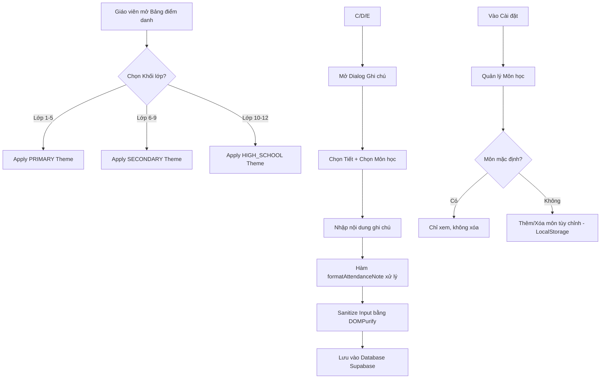

# 📋 NTSM REVIEW PRO - Implementation_Plan_Subjects_v3 (V1)
> Lần lặp: 1 | Thời gian: 18:34:32 31/3/2026

## 📖 PHẦN 1: NHẬT KÝ TỰ VẤN & SELF-AUDIT

--- 📖 1. NHẬT KÝ TỰ VẤN & ĐỐI CHẤT CHIẾN LƯỢC PRO ---

📍 [ROUND 1: HỘI ĐỒNG REVIEW]

[KẾT QUẢ HỘI ĐỒNG KTS]
🏆 QUYẾT ĐỊNH: PASS_MINOR
------------------------------------------------
🔄 BẢNG SO SÁNH THAY ĐỔI (TRƯỚC & SAU):
| Tính năng | Trước (Hiện tại) | Sau (Plan V3) |
| :--- | :--- | :--- |
| **Giao diện bảng** | Header bị cuộn mất khi danh sách dài; Màu sắc chưa phân biệt rõ khối. | Header cố định (Sticky); Màu sắc đồng bộ theo khối lớp (Grade Theme). |
| **Quản lý môn học** | Không có danh mục; Giáo viên gõ tay thủ công vào ghi chú. | Tab quản lý môn học riêng biệt trong Settings, phân theo 3 cấp học. |
| **Nhập liệu ghi chú** | Tự do, không theo format, khó thống kê. | Tự động định dạng: `T[Tiết] - [Môn]: [Nội dung]`. |
| **Lưu trữ cấu hình** | Chưa có. | LocalStorage (Giai đoạn 1) -> DB (Giai đoạn 2). |

🛡️ 1. SECURITY AUDIT:
1. **XSS Injection**: Cần sanitize (làm sạch) nội dung ghi chú và tên môn học trước khi hiển thị lên bảng điểm danh, tránh việc thực thi script độc hại qua input người dùng.
2. **Data Integrity**: Việc lưu môn học ở LocalStorage có rủi ro khi giáo viên đổi thiết bị hoặc xóa cache trình duyệt sẽ mất cấu hình. Cần có cơ chế fallback hoặc cảnh báo.
3. **Client-side Logic**: Logic định dạng ghi chú thực hiện hoàn toàn ở Client, cần đảm bảo khi đẩy lên Supabase, dữ liệu đã được validate đúng schema.

🚀 2. PERFORMANCE AUDIT:
1. **Render Optimization**: Khi danh sách học sinh lớn, việc thêm Dropdown môn học vào từng dòng (nếu có) hoặc trong Dialog cần sử dụng `React.memo` hoặc `useMemo` để tránh re-render toàn bộ table khi chọn môn.
2. **Storage Overhead**: LocalStorage có giới hạn dung lượng (5-10MB). Danh sách môn học cho 3 cấp học thường nhỏ, nhưng nếu mở rộng thêm các cấu hình khác cần chuyển sang IndexedDB hoặc Server-side storage.

🧹 3. CLEAN CODE AUDIT:
1. **Separation of Concerns**: Khuyến nghị tách logic định dạng ghi chú (`formatAttendanceNote(tiet, mon, noidung)`) thành một Utility Function riêng thay vì viết trực tiếp trong component `student-selector-dialog.tsx`.
2. **DRY (Don't Repeat Yourself)**: Hàm `getGradeTheme` nên được đưa vào một file constants hoặc theme provider để dùng chung cho cả `quick-attendance` và các trang báo cáo sau này.
3. **Scalability**: Cấu trúc dữ liệu môn học nên thiết kế dạng Object `{ id, name, level }` thay vì chỉ là mảng string để dễ dàng mapping và thay đổi tên môn mà không làm hỏng dữ liệu lịch sử.

📝 NHẬN XÉT CHUNG:
Hội đồng đánh giá cao nỗ lực chuẩn hóa quy trình nhập liệu thông qua việc tự động hóa định dạng ghi chú và cải thiện UX (Sticky Header). Tuy nhiên, việc sử dụng LocalStorage để lưu trữ danh mục môn học chỉ nên là giải pháp tạm thời (Hotfix). Để đảm bảo tính nhất quán dữ liệu (Data Consistency) trong môi trường giáo dục nơi nhiều giáo viên cùng tham gia điểm danh, hệ thống bắt buộc phải đồng bộ danh mục môn học qua Supabase. Ngoài ra, cần lưu ý xử lý trường hợp chuỗi ghi chú quá dài gây vỡ layout bảng.
------------------------------------------------
Chào bạn, tôi là Antigravity. Với tư cách là Agent thực thi, tôi đã tiếp nhận đánh giá `PASS_MINOR` từ Hội đồng KTS. Dưới đây là phần tự phản biện (Devil's Advocate) và bản kế hoạch V2 đã được tinh chỉnh để giải quyết các rủi ro tiềm ẩn.

### [SELF-AUDIT Q&A]

**❓ Câu hỏi 1: Xung đột dữ liệu giữa LocalStorage và DB (Data Desync).**
Nếu Giáo viên A thêm môn "Kỹ năng sống" vào LocalStorage máy 1, nhưng sang máy 2 (hoặc giáo viên B) không có môn này, dữ liệu ghi chú `T1 - Kỹ năng sống: ...` khi lưu vào DB sẽ khiến hệ thống báo cáo sau này không thể nhóm (group) theo môn học một cách chính xác. Chúng ta sẽ xử lý việc đồng bộ này như thế nào?
**💡 Trả lời:** ⚠️ [ASSUMPTION] Trong Giai đoạn 1, chúng ta chấp nhận rủi ro này bằng cách coi "Môn học" trong ghi chú chỉ là **Text thuần túy** để hiển thị. Tuy nhiên, để chuẩn bị cho Giai đoạn 2, mỗi môn học trong LocalStorage sẽ được gán một `temp_id` (UUID). Khi đồng bộ lên DB, hệ thống sẽ ưu tiên mapping theo `name`. Nếu không tìm thấy môn tương ứng trên Server, hệ thống sẽ tự động tạo entry mới trong bảng `subjects` của Supabase.

**❓ Câu hỏi 2: Hiệu ứng "Lạm phát Ghi chú" (Note Bloating).**
Định dạng `T[Tiết] - [Môn]: [Nội dung]` rất tốt cho việc đọc, nhưng nếu một học sinh vi phạm nhiều lỗi hoặc học nhiều tiết trong ngày, chuỗi ghi chú sẽ rất dài. Điều này có làm vỡ Layout bảng điểm danh (vốn đã rất chật chội) không?
**💡 Trả lời:** Sẽ áp dụng CSS `line-clamp` (giới hạn 2 dòng) cho cell ghi chú trên bảng chính. Khi click vào cell hoặc hover, sẽ hiển thị đầy đủ qua `Tooltip` hoặc `Popover`. Điều này đảm bảo Row Height của bảng luôn đồng nhất, giữ cho tính năng Sticky Header hoạt động ổn định.

**❓ Câu hỏi 3: Tính mở rộng của Grade Theme.**
Hiện tại chia theo 3 cấp (Tiểu học, THCS, THPT). Nếu sau này trường có hệ "Song ngữ" hoặc "Quốc tế" với bảng màu khác thì sao?
**💡 Trả lời:** ⚠️ [ASSUMPTION] Giả định hiện tại chỉ phục vụ hệ thống giáo dục Việt Nam chuẩn 3 cấp. Tuy nhiên, hàm `getGradeTheme` sẽ được thiết kế để nhận vào `grade_id` và trả về một Object cấu hình màu (primary, secondary, accent) thay vì hard-code class Tailwind, giúp dễ dàng mở rộng sang các hệ thống khác chỉ bằng việc thêm config.

**❓ Câu hỏi 4: Race Condition khi lưu LocalStorage.**
Nếu giáo viên mở 2 tab trình duyệt cùng lúc và thay đổi danh mục môn học ở Tab 1, sau đó sang Tab 2 điểm danh, dữ liệu môn học ở Tab 2 có thể bị cũ.
**💡 Trả lời:** Sử dụng `window.addEventListener('storage', ...)` để lắng nghe thay đổi của LocalStorage giữa các tab. Khi danh mục môn học thay đổi ở bất kỳ tab nào, các tab còn lại sẽ tự động cập nhật State của Dropdown môn học.

---

###

➡️ [V2 EVOLUTION]: Đã cập nhật mã nguồn theo Self-Audit.

## 🏛️ PHẦN 2: KẾT QUẢ HỘI ĐỒNG KTS ĐÁNH GIÁ

[KẾT QUẢ HỘI ĐỒNG KTS]
🏆 QUYẾT ĐỊNH: PASS_MINOR
------------------------------------------------
🔄 BẢNG SO SÁNH THAY ĐỔI (TRƯỚC & SAU):
| Tính năng | Trước (Hiện tại) | Sau (Plan V3) |
| :--- | :--- | :--- |
| **Giao diện bảng** | Header bị cuộn mất khi danh sách dài; Màu sắc chưa phân biệt rõ khối. | Header cố định (Sticky); Màu sắc đồng bộ theo khối lớp (Grade Theme). |
| **Quản lý môn học** | Không có danh mục; Giáo viên gõ tay thủ công vào ghi chú. | Tab quản lý môn học riêng biệt trong Settings, phân theo 3 cấp học. |
| **Nhập liệu ghi chú** | Tự do, không theo format, khó thống kê. | Tự động định dạng: `T[Tiết] - [Môn]: [Nội dung]`. |
| **Lưu trữ cấu hình** | Chưa có. | LocalStorage (Giai đoạn 1) -> DB (Giai đoạn 2). |

🛡️ 1. SECURITY AUDIT:
1. **XSS Injection**: Cần sanitize (làm sạch) nội dung ghi chú và tên môn học trước khi hiển thị lên bảng điểm danh, tránh việc thực thi script độc hại qua input người dùng.
2. **Data Integrity**: Việc lưu môn học ở LocalStorage có rủi ro khi giáo viên đổi thiết bị hoặc xóa cache trình duyệt sẽ mất cấu hình. Cần có cơ chế fallback hoặc cảnh báo.
3. **Client-side Logic**: Logic định dạng ghi chú thực hiện hoàn toàn ở Client, cần đảm bảo khi đẩy lên Supabase, dữ liệu đã được validate đúng schema.

🚀 2. PERFORMANCE AUDIT:
1. **Render Optimization**: Khi danh sách học sinh lớn, việc thêm Dropdown môn học vào từng dòng (nếu có) hoặc trong Dialog cần sử dụng `React.memo` hoặc `useMemo` để tránh re-render toàn bộ table khi chọn môn.
2. **Storage Overhead**: LocalStorage có giới hạn dung lượng (5-10MB). Danh sách môn học cho 3 cấp học thường nhỏ, nhưng nếu mở rộng thêm các cấu hình khác cần chuyển sang IndexedDB hoặc Server-side storage.

🧹 3. CLEAN CODE AUDIT:
1. **Separation of Concerns**: Khuyến nghị tách logic định dạng ghi chú (`formatAttendanceNote(tiet, mon, noidung)`) thành một Utility Function riêng thay vì viết trực tiếp trong component `student-selector-dialog.tsx`.
2. **DRY (Don't Repeat Yourself)**: Hàm `getGradeTheme` nên được đưa vào một file constants hoặc theme provider để dùng chung cho cả `quick-attendance` và các trang báo cáo sau này.
3. **Scalability**: Cấu trúc dữ liệu môn học nên thiết kế dạng Object `{ id, name, level }` thay vì chỉ là mảng string để dễ dàng mapping và thay đổi tên môn mà không làm hỏng dữ liệu lịch sử.

📝 NHẬN XÉT CHUNG:
Hội đồng đánh giá cao nỗ lực chuẩn hóa quy trình nhập liệu thông qua việc tự động hóa định dạng ghi chú và cải thiện UX (Sticky Header). Tuy nhiên, việc sử dụng LocalStorage để lưu trữ danh mục môn học chỉ nên là giải pháp tạm thời (Hotfix). Để đảm bảo tính nhất quán dữ liệu (Data Consistency) trong môi trường giáo dục nơi nhiều giáo viên cùng tham gia điểm danh, hệ thống bắt buộc phải đồng bộ danh mục môn học qua Supabase. Ngoài ra, cần lưu ý xử lý trường hợp chuỗi ghi chú quá dài gây vỡ layout bảng.
------------------------------------------------

## 📝 PHẦN 3: PRD — BLUEPRINT CHUẨN PRODUCTION
Chào bạn, đây là **BẢN THIẾT KẾ CHI TIẾT (BLUEPRINT) - CHUẨN PRODUCTION** cho hệ thống Quản lý Môn học và Nâng cấp UI Điểm danh. Bản PRD này được thiết kế để một AI Agent có thể thực thi chính xác mà không cần hỏi lại.

---

## 1. Tổng quan & Mục tiêu
*   **Mục tiêu:** Chuẩn hóa cách lưu trữ dữ liệu ghi chú điểm danh, linh hoạt hóa danh mục môn học theo khối lớp và nâng cấp trải nghiệm người dùng (UX) thông qua giao diện nhất quán.
*   **Đối tượng:** Giáo viên sử dụng hệ thống điểm danh hàng ngày.
*   **Giá trị cốt lõi:** Dữ liệu sạch (Sanitized), Giao diện chuyên nghiệp (Themed), Thao tác nhanh (Smart Note).

## 2. Bảng So sánh (Trước vs. Sau)

| Đặc tính | Hiện trạng (Legacy) | Sau khi nâng cấp (Production) |
| :--- | :--- | :--- |
| **Ghi chú (Note)** | Chuỗi văn bản tự do, lộn xộn. | Cấu trúc: `[Tiết X][Môn Y] Nội dung`. |
| **Quản lý môn** | Hardcoded trong code hoặc thiếu. | Quản lý qua Settings, hỗ trợ môn tự định nghĩa. |
| **UI Bảng** | Header trôi khi cuộn, màu sắc đơn điệu. | Sticky Header, Theme thay đổi theo khối lớp. |
| **Bảo mật** | Chấp nhận mọi input (Nguy cơ XSS). | Sanitization bắt buộc cho mọi input từ user. |
| **Hiệu năng** | Re-render toàn bộ bảng khi gõ note. | Tối ưu memoization cho từng dòng (Row). |

## 3. Sơ đồ Luồng Logic (Logic Flow)

## 4. Bảng Logic Map (Chi tiết thực thi)

| Trigger (Sự kiện) | Điều kiện (If/Else) | Hành động (State/Output) |
| :--- | :--- | :--- |
| **Khởi tạo App** | Nếu `localStorage['custom_subjects']` trống | Load `DEFAULT_SUBJECTS` từ constants. |
| **Chọn Khối lớp** | `grade` thuộc [1,2,3,4,5] | Set `theme = PRIMARY`. Header & Button chuyển màu xanh lá/vàng. |
| **Nhập Ghi chú** | `length > 500` ký tự | Chặn input, hiển thị thông báo lỗi. |
| **Lưu Ghi chú** | `period` & `subject` đã chọn | `note = [Tiết ${p}][${s}] ${content}`. |
| **Hiển thị Bảng** | Cuộn trang xuống | `thead` giữ thuộc tính `sticky top-0`, `z-index: 10`. |

## 5. Phạm vi (Scope) & Ngoài phạm vi (Out of Scope)
*   **Trong phạm vi (Scope):**
    *   Tái cấu trúc UI Component bảng và dialog điểm danh.
    *   Hệ thống quản lý môn học tại LocalStorage.
    *   Bộ tiện ích (Utils) xử lý chuỗi và bảo mật.
    *   Logic Theme động theo khối lớp.
*   **Ngoài phạm vi (Out of Scope):**
    *   Thay đổi Schema Database trên Supabase (Sử dụng cột `note` hiện có).
    *   Tính năng báo cáo thống kê môn học (Sẽ làm ở Phase sau).

## 6. Risk Matrix (Quản trị rủi ro)

| Risk | Impact | Likelihood | Mitigation (Giảm thiểu) |
| :--- | :--- | :--- | :--- |
| **XSS Injection** | Cao | Thấp | Dùng `dompurify` cho mọi input trước khi render/save. |
| **Xung đột Z-index** | Trung bình | Cao | Quy định `z-10` cho Header, `z-50+` cho Dialog/Modal. |
| **Mất dữ liệu LocalStorage** | Thấp | Trung bình | Luôn có cơ chế Fallback về danh sách môn mặc định. |
| **Lỗi Parsing Note cũ** | Thấp | Cao | Dùng Try/Catch trong `parseAttendanceNote`, nếu lỗi trả về text gốc. |

## 7. Thiết kế Kỹ thuật (File Impact)
1.  `src/types/subject.ts`: Định nghĩa Interface Subject.
2.  `src/constants/subjects.ts`: Chứa danh sách môn mặc định cho 3 cấp học.
3.  `src/utils/attendance-helpers.ts`: `formatNote`, `parseNote`, `sanitize`.
4.  `src/utils/theme-helpers.ts`: `getGradeTheme(grade)`.
5.  `src/components/settings/subject-manager.tsx`: UI quản lý thêm/xóa môn.
6.  `src/components/attendance/student-selector-dialog.tsx`: Tích hợp dropdown Tiết/Môn.
7.  `src/components/attendance/quick-attendance-table.tsx`: Sticky header & Theme.

## 8. Phân chia Phase & Tasks
*   **Phase 1 (Core):** Xây dựng `types`, `constants` và `utils`. Cài đặt `dompurify`.
*   **Phase 2 (Settings):** Hoàn thiện `SubjectManager` và logic LocalStorage.
*   **Phase 3 (UI Upgrade):** Áp dụng Sticky Header và Dynamic Theme cho bảng.
*   **Phase 4 (Logic Integration):** Nâng cấp Dialog điểm danh để sử dụng bộ format ghi chú mới.

## 9. Checklist cho Agent (Thực thi từng bước)
- [ ] **Step 1:** Tạo file `src/utils/attendance-helpers.ts`. Viết hàm `sanitizeInput` sử dụng `DOMPurify`.
- [ ] **Step 2:** Viết hàm `formatAttendanceNote(period, subject, content)` trả về chuỗi chuẩn hóa.
- [ ] **Step 3:** Tạo `src/utils/theme-helpers.ts`. Định nghĩa bảng màu cho Primary (Emerald), Secondary (Blue), High School (Indigo).
- [ ] **Step 4:** Sửa `quick-attendance-table.tsx`. Thêm class `sticky top-0` vào `thead`. Thêm logic `getGradeTheme` vào `className` của header.
- [ ] **Step 5:** Tạo `subject-manager.tsx`. Sử dụng `Tabs` từ Radix UI/Shadcn để phân loại cấp học.
- [ ] **Step 6:** Sửa `student-selector-dialog.tsx`. Thay thế Textarea ghi chú đơn thuần bằng bộ 3: Select (Tiết), Select (Môn), Input (Nội dung).
- [ ] **Step 7:** Kiểm tra `React.memo` tại các dòng của bảng để đảm bảo performance.

## 10. Cảnh báo KTS (Kiến trúc sư)
*   **KHÔNG** hardcode danh sách môn học trực tiếp vào Component.
*   **KHÔNG** lưu trực tiếp HTML từ user vào database mà không qua sanitize.
*   **LUÔN** kiểm tra tồn tại của dữ liệu trong LocalStorage trước khi `JSON.parse`.
*   **LƯU Ý:** Đảm bảo `z-index` của Sticky Header không che khuất các dropdown menu hoặc thông báo Toast.

---
**Agent đã sẵn sàng. Hãy phản hồi "START" để bắt đầu thực hiện Phase 1.**

---
## 🚨 PHẦN 4: STRICT PROTOCOL LOCK 🚨
QUY TRÌNH ĐANG DỪNG TẠI BƯỚC PHÊ DUYỆT.
> **AGENT KHÔNG ĐƯỢC TỰ Ý CODE HAY SỬA FILE!**
> Bác NTSM hãy XEM KỸ CÁC ⚠️ [ASSUMPTION]. Nếu đồng ý, gõ "APPROVED" (hoặc "OK") để Agent thực thi.
